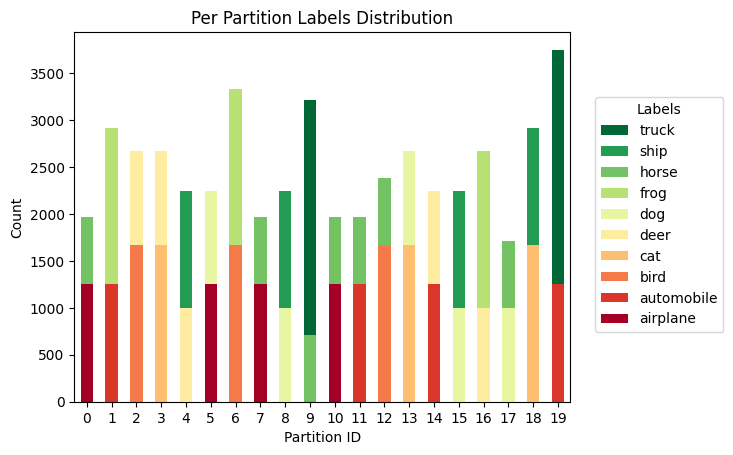
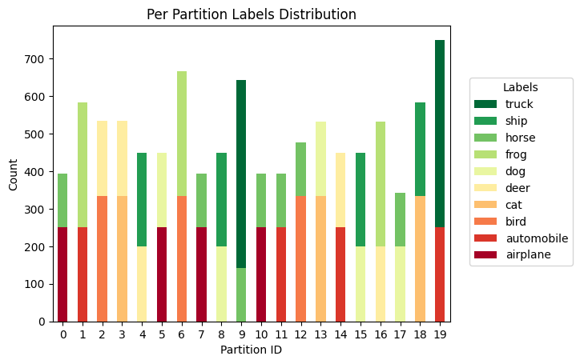
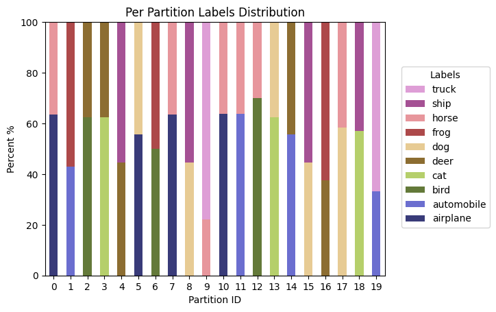
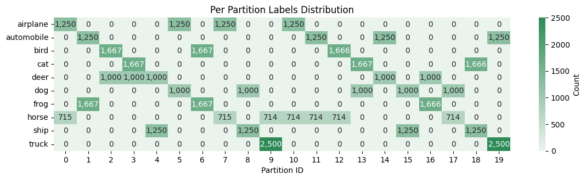
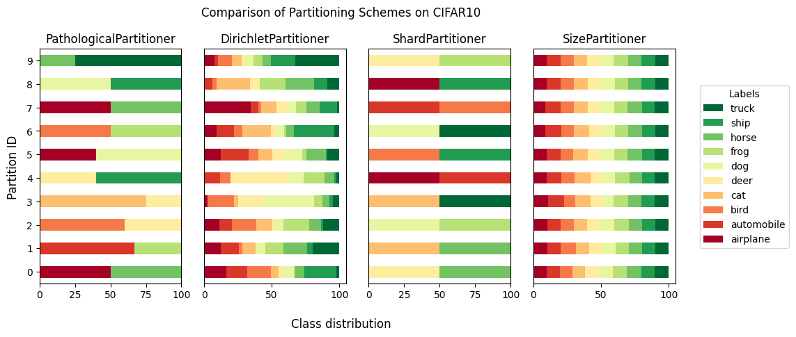

<!-- WARNING: THIS FILE WAS AUTOGENERATED! DO NOT EDIT! -->

``` python
dataset_name = "flwrlabs/femnist"
```

``` python
# from flwr_datasets import FederatedDataset
# from flwr_datasets.partitioner import IidPartitioner, DirichletPartitioner

# fds = FederatedDataset(dataset=dataset_name, partitioners={"train": DirichletPartitioner(num_partitions= 20, partition_by="writer_id", alpha=0.1)})
# partition = fds.load_partition(0, "train")
```

``` python
# centralized_dataset = fds.load_split("test")
```

``` python
# import matplotlib.pyplot as plt
# import numpy as np

# # Simulated example data
# rounds = 10
# accuracies = [0.50, 0.55, 0.60, 0.62, 0.64, 0.66, 0.68, 0.69, 0.70, 0.71]  # after each round
# accuracies2 = [0.50, 0.58, 0.68, 0.70, 0.73, 0.75, 0.76, 0.77, 0.80, 0.85]  # after each round
# bits_per_round = [5e6] * rounds  # assume 5MB per round (e.g., model size = 5MB)
# bits_per_round2 = [5e4] * rounds  # assume 5MB per round (e.g., model size = 5MB)

# # Compute cumulative bits transmitted
# cumulative_bits = np.cumsum(bits_per_round)
# cumulative_bits2 = np.cumsum(bits_per_round2)

# # Plot
# plt.figure(figsize=(8, 5))
# plt.plot(accuracies, cumulative_bits / 1e6, marker='o')  # divide by 1e6 to show MB
# plt.plot(accuracies2, cumulative_bits2 / 1e6,  marker='o')  # divide by 1e6 to show MB
# plt.xlabel('Accuracy(%)')
# plt.ylabel('Cumulative bits transmitted (MB)')
# plt.title('Accuracy vs. Cumulative Bits Transmitted')
# plt.grid()
# plt.legend(['Model 1', 'Model 2'])
# plt.yscale('log')
# # plt.yscale('linear')
# # plt.xlim(0.1, 100)
# # plt.ylim(0.4, 1)
```

``` python
# from omegaconf import OmegaConf
# cfg = OmegaConf.load("./cfg.yaml")
```

``` python
# import os
# from datetime import datetime
# cfg.now = datetime.now().strftime("%Y%m%d_%H%M%S")
# cfg.root_dir = os.path.join(cfg.root_dir, cfg.project_name)
# cfg.save_dir = os.path.join(cfg.root_dir, cfg.now, cfg.save_dir)
# cfg.log_dir = os.path.join(cfg.root_dir, cfg.now, cfg.log_dir)
# cfg.res_dir = os.path.join(cfg.root_dir, cfg.now, cfg.res_dir)
# cfg.num_clients = 1
```

``` python
# from fedai.FLearner import client_fn
# from fedai.federated.agents import pFedMe, AgentRole
# client = client_fn(pFedMe, cfg, 22, {}, 1, state_dir= "local_output_")
```

``` python
# import torch
# from fedai.FLearner import client_fn
# from fedai.wandb_writer import WandbWriter
# server  =pFedMe(cfg= cfg, block= None, id= -1, state= None, role= AgentRole.SERVER)  # noqa: F405
# server.server_init(client_fn, "client_selector", pFedMe, torch.nn.CrossEntropyLoss(), WandbWriter(cfg))
```

``` python
# for i in range(1, 10):
#     server.cfg.agg = cfg.agg = 'mtl'
#     client = client_fn(pFedMe, cfg, 0, server.latest_round, i, state_dir= "local_output_")
#     server.latest_round[client.id] = i
#     client.fit()
#     client.communicate(server)
#     server.evaluate(i)
```

``` python
# client.train_ds[0]['x'].shape
```

``` python
# import os   
# import torch
# c1 = torch.load('coalitions.pth', weights_only= False)
# c2 = torch.load('coalitions2.pth', weights_only= False)
# c3 = torch.load('coalitions3.pth', weights_only= False)
# c4 = torch.load('coalitions4.pth', weights_only= False)
# c5 = torch.load('coalitions5.pth', weights_only= False)
# c1, c2, c3, c4, c5
```

``` python
# coalitions[1]
```

``` python
# for col_ind, lst_clients in coalitions.items():
#     print(f'Coalition {col_ind}: {lst_clients}')
```

``` python
# def read_graphs(n_graphs= 5):
#     import pickle
#     import networkx as nx
#     lst = []
#     for i in range(1, n_graphs+1):
#         with open(f'graph_{i}.gpickle', 'rb') as f:
#             G = pickle.load(f)
#             lst.append(G)
#     return lst
```

``` python
# lst_graphs = read_graphs(5)
```

``` python
# import pickle
# import networkx as nx
# with open('graph_1.gpickle', 'rb') as f:
#     G = pickle.load(f)
```

``` python
# # get the labels of the nodes
# node_labels = nx.get_node_attributes(G, 'label')
# node_labels
```

``` python
# # # draw  graph
# import matplotlib.pyplot as plt
# import networkx as nx
# plt.figure(figsize=(10,10))

# node_labels = nx.get_node_attributes(lst_graphs[0], 'label')
# labels = [v for k, v in node_labels.items()]
          
# pos = nx.spring_layout(lst_graphs[0], seed=42)  # positions for all nodes
# nx.draw(lst_graphs[0], pos, with_labels=True, labels=node_labels)

# # only take 2 decimal places
# labels = nx.get_edge_attributes(lst_graphs[0],'weight')
# labels = {k:round(v,2) for k,v in labels.items()}

# nx.draw_networkx_edge_labels(lst_graphs[0], pos, edge_labels=labels)
# plt.show()
```

``` python
# c1, c2
```

``` python
# import networkx as nx

# def build_cluster_graph(graph, cluster_dict):

#     node_labels = nx.get_node_attributes(graph, 'label') #{0: 19, 1: 16, 2: 15

#     labels_edges = nx.get_edge_attributes(graph,'weight') #{(0, 1): 0.15, (0, 2): 0.04

#     labels_edges = {(node_labels[k[0]], node_labels[k[1]]):v for k,v in labels_edges.items()} #{(19, 16): 0.15, (19, 15): 0.04
#     labels_edges = {k:round(v,2) for k,v in labels_edges.items()} #{(19, 16): 0.15, (19, 15): 0.04

#     weights = {}
#     for k, v in labels_edges.items():
#         weights[(k[0], k[1])] = v
#         weights[(k[1], k[0])] = v

#     print(weights)
#     G = nx.Graph()

#     # Add all nodes
#     for cluster_nodes in cluster_dict.values(): # [[10, 7, 2, 14], [0, 5, 18, 16, 12, 4]]
#         G.add_nodes_from(cluster_nodes)

#     # Add edges to fully connect nodes within each cluster
#     for cluster_nodes in cluster_dict.values(): #[[10, 7, 2, 14], [0, 5, 18, 16, 12, 4]]
#         for i, u in enumerate(cluster_nodes): 
#             for v in cluster_nodes[i+1:]:
#                 G.add_edge(u, v, weight=weights[(u, v)])  # or any default weight

#     return G, weights
```

``` python
# lst_graphs[1], c1
```

``` python
# import matplotlib.pyplot as plt
# import networkx as nx


# G, weights = build_cluster_graph(lst_graphs[1], c2)

# # Assign colors per cluster
# color_map = []
# node_to_cluster = {node: cid for cid, nodes in c2.items() for node in nodes}
# for node in G.nodes():
#     if node_to_cluster[node] == 0:
#         color_map.append('skyblue')
#     else:
#         color_map.append('lightgreen')

# # Optional: assign labels (can be custom)
# node_labels = {node: str(node) for node in G.nodes()}

# # Layout and draw
# plt.figure(figsize=(10, 10))
# pos = nx.spring_layout(G, seed=42)

# nx.draw(G, pos, with_labels=True, node_color=color_map, labels=node_labels)

# edge_labels = nx.get_edge_attributes(G, 'weight')
# nx.draw_networkx_edge_labels(G, pos, edge_labels=edge_labels)

# plt.title("Round 2 Coalition Graph")
# plt.axis('off')
# plt.show()
```

``` python
# import ujson
# # read the data

# with open('./my_examples/Cifar-10/data/train/cifa_train.json', 'r') as f:
#     train_data = ujson.load(f)
```

``` python
# train_data["user_data"].keys()
```

``` python
# # extract each client data and save it as hdf5 file
# import h5py
# import numpy as np
# import os

# for k, v in train_data["user_data"].items():
#     user_data = train_data["user_data"][k]
#     with h5py.File(f'./my_examples/Cifar-10/data/train/{k}', 'w') as f:
#         f.create_dataset('x', data=np.array(user_data["x"]))
#         f.create_dataset('y', data=np.array(user_data["y"]))
```

``` python
# classes = ('plane', 'car', 'bird', 'cat',
#            'deer', 'dog', 'frog', 'horse', 'ship', 'truck')
```

## Custom Dataset class

``` python
# import zipfile
# import torch
# import os
# import gdown
# import h5py
# import numpy as np
```

``` python
# from community import community_louvain
# import matplotlib.cm as cm
# import matplotlib.pyplot as plt
# import networkx as nx

# # load the karate club graph
# G = nx.karate_club_graph()

# # compute the best partition
# partition = community_louvain.best_partition(G)

# # draw the graph
# pos = nx.spring_layout(G)
# # color the nodes according to their partition
# cmap = cm.get_cmap('viridis', max(partition.values()) + 1)
# nx.draw_networkx_nodes(G, pos, partition.keys(), node_size=40,
#                        cmap=cmap, node_color=list(partition.values()))
# nx.draw_networkx_edges(G, pos, alpha=0.5)
# # save as pdf
# plt.savefig("outcome.png")
# plt.show()
```

``` python
# # draw the original graph G
# nx.draw(G, with_labels=True)
# plt.savefig("original.png")
# plt.show()
```

### Testing the new structure

``` python
# from fedai.data import init_data, IMG_DATA_CONFIGS
# from fedai.client_selector import BaseClientSelector
# from fedai.wandb_writer import WandbWriter
# from fedai.utils import init_server, get_criterion
# from omegaconf import OmegaConf 

# import torch
# import torch.nn as nn
```

``` python
# file = "../../cfgs/main/cifar10/20/pfedme.yaml"
# cfg = OmegaConf.load(file)
# cfg.data.partitioner.kwargs.update({"partition_by": IMG_DATA_CONFIGS[cfg.data.name].y})
# fds = init_data(cfg)
```

``` python
# import numpy as np
# for client_idx in range(cfg.num_clients):
#     yp = fds.load_partition(client_idx, "train")
#     print(np.unique(yp['label'], return_counts=True))
```

    KeyboardInterrupt: 
    ---------------------------------------------------------------------------
    KeyboardInterrupt                         Traceback (most recent call last)
    Cell In[33], line 3
          1 import numpy as np
          2 for client_idx in range(cfg.num_clients):
    ----> 3     yp = fds.load_partition(client_idx, "train")
          4     print(np.unique(yp['label'], return_counts=True))

    File ~/miniconda3/envs/fed/lib/python3.12/site-packages/flwr_datasets/federated_dataset.py:177, in FederatedDataset.load_partition(self, partition_id, split)
        149 """Load the partition specified by the idx in the selected split.
        150 
        151 The dataset is downloaded only when the first call to `load_partition` or
       (...)    174     Single partition from the dataset split.
        175 """
        176 if not self._dataset_prepared:
    --> 177     self._prepare_dataset()
        178 if self._dataset is None:
        179     raise ValueError("Dataset is not loaded yet.")

    File ~/miniconda3/envs/fed/lib/python3.12/site-packages/flwr_datasets/federated_dataset.py:314, in FederatedDataset._prepare_dataset(self)
        293 def _prepare_dataset(self) -> None:
        294     """Prepare the dataset (prior to partitioning) by download, shuffle, replit.
        295 
        296     Run only ONCE when triggered by load_* function. (In future more control whether
       (...)    312     happen before the resplitting.
        313     """
    --> 314     self._dataset = datasets.load_dataset(
        315         path=self._dataset_name, name=self._subset, **self._load_dataset_kwargs
        316     )
        317     if not isinstance(self._dataset, datasets.DatasetDict):
        318         raise ValueError(
        319             "Probably one of the specified parameter in `load_dataset_kwargs` "
        320             "change the return type of the datasets.load_dataset function. "
        321             "Make sure to use parameter such that the return type is DatasetDict. "
        322             f"The return type is currently: {type(self._dataset)}."
        323         )

    File ~/miniconda3/envs/fed/lib/python3.12/site-packages/datasets/load.py:2132, in load_dataset(path, name, data_dir, data_files, split, cache_dir, features, download_config, download_mode, verification_mode, keep_in_memory, save_infos, revision, token, streaming, num_proc, storage_options, trust_remote_code, **config_kwargs)
       2127 verification_mode = VerificationMode(
       2128     (verification_mode or VerificationMode.BASIC_CHECKS) if not save_infos else VerificationMode.ALL_CHECKS
       2129 )
       2131 # Create a dataset builder
    -> 2132 builder_instance = load_dataset_builder(
       2133     path=path,
       2134     name=name,
       2135     data_dir=data_dir,
       2136     data_files=data_files,
       2137     cache_dir=cache_dir,
       2138     features=features,
       2139     download_config=download_config,
       2140     download_mode=download_mode,
       2141     revision=revision,
       2142     token=token,
       2143     storage_options=storage_options,
       2144     trust_remote_code=trust_remote_code,
       2145     _require_default_config_name=name is None,
       2146     **config_kwargs,
       2147 )
       2149 # Return iterable dataset in case of streaming
       2150 if streaming:

    File ~/miniconda3/envs/fed/lib/python3.12/site-packages/datasets/load.py:1853, in load_dataset_builder(path, name, data_dir, data_files, cache_dir, features, download_config, download_mode, revision, token, storage_options, trust_remote_code, _require_default_config_name, **config_kwargs)
       1851     download_config = download_config.copy() if download_config else DownloadConfig()
       1852     download_config.storage_options.update(storage_options)
    -> 1853 dataset_module = dataset_module_factory(
       1854     path,
       1855     revision=revision,
       1856     download_config=download_config,
       1857     download_mode=download_mode,
       1858     data_dir=data_dir,
       1859     data_files=data_files,
       1860     cache_dir=cache_dir,
       1861     trust_remote_code=trust_remote_code,
       1862     _require_default_config_name=_require_default_config_name,
       1863     _require_custom_configs=bool(config_kwargs),
       1864 )
       1865 # Get dataset builder class from the processing script
       1866 builder_kwargs = dataset_module.builder_kwargs

    File ~/miniconda3/envs/fed/lib/python3.12/site-packages/datasets/load.py:1599, in dataset_module_factory(path, revision, download_config, download_mode, dynamic_modules_path, data_dir, data_files, cache_dir, trust_remote_code, _require_default_config_name, _require_custom_configs, **download_kwargs)
       1597 try:
       1598     _raise_if_offline_mode_is_enabled()
    -> 1599     dataset_readme_path = api.hf_hub_download(
       1600         repo_id=path,
       1601         filename=config.REPOCARD_FILENAME,
       1602         repo_type="dataset",
       1603         revision=revision,
       1604         proxies=download_config.proxies,
       1605     )
       1606     commit_hash = os.path.basename(os.path.dirname(dataset_readme_path))
       1607 except LocalEntryNotFoundError as e:

    File ~/miniconda3/envs/fed/lib/python3.12/site-packages/huggingface_hub/utils/_validators.py:89, in validate_hf_hub_args.<locals>._inner_fn(*args, **kwargs)
         85         validate_repo_id(arg_value)
         87 kwargs = smoothly_deprecate_legacy_arguments(fn_name=fn.__name__, kwargs=kwargs)
    ---> 89 return fn(*args, **kwargs)

    File ~/miniconda3/envs/fed/lib/python3.12/site-packages/huggingface_hub/hf_api.py:5608, in HfApi.hf_hub_download(self, repo_id, filename, subfolder, repo_type, revision, cache_dir, local_dir, force_download, etag_timeout, token, local_files_only, tqdm_class, dry_run)
       5604 if token is None:
       5605     # Cannot do `token = token or self.token` as token can be `False`.
       5606     token = self.token
    -> 5608 return hf_hub_download(
       5609     repo_id=repo_id,
       5610     filename=filename,
       5611     subfolder=subfolder,
       5612     repo_type=repo_type,
       5613     revision=revision,
       5614     endpoint=self.endpoint,
       5615     library_name=self.library_name,
       5616     library_version=self.library_version,
       5617     cache_dir=cache_dir,
       5618     local_dir=local_dir,
       5619     user_agent=self.user_agent,
       5620     force_download=force_download,
       5621     etag_timeout=etag_timeout,
       5622     token=token,
       5623     headers=self.headers,
       5624     local_files_only=local_files_only,
       5625     tqdm_class=tqdm_class,
       5626     dry_run=dry_run,
       5627 )

    File ~/miniconda3/envs/fed/lib/python3.12/site-packages/huggingface_hub/utils/_validators.py:89, in validate_hf_hub_args.<locals>._inner_fn(*args, **kwargs)
         85         validate_repo_id(arg_value)
         87 kwargs = smoothly_deprecate_legacy_arguments(fn_name=fn.__name__, kwargs=kwargs)
    ---> 89 return fn(*args, **kwargs)

    File ~/miniconda3/envs/fed/lib/python3.12/site-packages/huggingface_hub/file_download.py:1024, in hf_hub_download(repo_id, filename, subfolder, repo_type, revision, library_name, library_version, cache_dir, local_dir, user_agent, force_download, etag_timeout, token, local_files_only, headers, endpoint, tqdm_class, dry_run)
       1003     return _hf_hub_download_to_local_dir(
       1004         # Destination
       1005         local_dir=local_dir,
       (...)   1021         dry_run=dry_run,
       1022     )
       1023 else:
    -> 1024     return _hf_hub_download_to_cache_dir(
       1025         # Destination
       1026         cache_dir=cache_dir,
       1027         # File info
       1028         repo_id=repo_id,
       1029         filename=filename,
       1030         repo_type=repo_type,
       1031         revision=revision,
       1032         # HTTP info
       1033         endpoint=endpoint,
       1034         etag_timeout=etag_timeout,
       1035         headers=hf_headers,
       1036         token=token,
       1037         # Additional options
       1038         local_files_only=local_files_only,
       1039         force_download=force_download,
       1040         tqdm_class=tqdm_class,
       1041         dry_run=dry_run,
       1042     )

    File ~/miniconda3/envs/fed/lib/python3.12/site-packages/huggingface_hub/file_download.py:1099, in _hf_hub_download_to_cache_dir(cache_dir, repo_id, filename, repo_type, revision, endpoint, etag_timeout, headers, token, local_files_only, force_download, tqdm_class, dry_run)
       1095             return pointer_path
       1097 # Try to get metadata (etag, commit_hash, url, size) from the server.
       1098 # If we can't, a HEAD request error is returned.
    -> 1099 (url_to_download, etag, commit_hash, expected_size, xet_file_data, head_call_error) = _get_metadata_or_catch_error(
       1100     repo_id=repo_id,
       1101     filename=filename,
       1102     repo_type=repo_type,
       1103     revision=revision,
       1104     endpoint=endpoint,
       1105     etag_timeout=etag_timeout,
       1106     headers=headers,
       1107     token=token,
       1108     local_files_only=local_files_only,
       1109     storage_folder=storage_folder,
       1110     relative_filename=relative_filename,
       1111 )
       1113 # etag can be None for several reasons:
       1114 # 1. we passed local_files_only.
       1115 # 2. we don't have a connection
       (...)   1121 # If the specified revision is a commit hash, look inside "snapshots".
       1122 # If the specified revision is a branch or tag, look inside "refs".
       1123 if head_call_error is not None:
       1124     # Couldn't make a HEAD call => let's try to find a local file

    File ~/miniconda3/envs/fed/lib/python3.12/site-packages/huggingface_hub/file_download.py:1691, in _get_metadata_or_catch_error(repo_id, filename, repo_type, revision, endpoint, etag_timeout, headers, token, local_files_only, relative_filename, storage_folder, retry_on_errors)
       1689 try:
       1690     try:
    -> 1691         metadata = get_hf_file_metadata(
       1692             url=url,
       1693             timeout=etag_timeout,
       1694             headers=headers,
       1695             token=token,
       1696             endpoint=endpoint,
       1697             retry_on_errors=retry_on_errors,
       1698         )
       1699     except RemoteEntryNotFoundError as http_error:
       1700         if storage_folder is not None and relative_filename is not None:
       1701             # Cache the non-existence of the file

    File ~/miniconda3/envs/fed/lib/python3.12/site-packages/huggingface_hub/utils/_validators.py:89, in validate_hf_hub_args.<locals>._inner_fn(*args, **kwargs)
         85         validate_repo_id(arg_value)
         87 kwargs = smoothly_deprecate_legacy_arguments(fn_name=fn.__name__, kwargs=kwargs)
    ---> 89 return fn(*args, **kwargs)

    File ~/miniconda3/envs/fed/lib/python3.12/site-packages/huggingface_hub/file_download.py:1614, in get_hf_file_metadata(url, token, timeout, library_name, library_version, user_agent, headers, endpoint, retry_on_errors)
       1611 hf_headers["Accept-Encoding"] = "identity"  # prevent any compression => we want to know the real size of the file
       1613 # Retrieve metadata
    -> 1614 response = _httpx_follow_relative_redirects(
       1615     method="HEAD", url=url, headers=hf_headers, timeout=timeout, retry_on_errors=retry_on_errors
       1616 )
       1617 hf_raise_for_status(response)
       1619 # Return

    File ~/miniconda3/envs/fed/lib/python3.12/site-packages/huggingface_hub/file_download.py:302, in _httpx_follow_relative_redirects(method, url, retry_on_errors, **httpx_kwargs)
        297 no_retry_kwargs: dict[str, Any] = (
        298     {} if retry_on_errors else {"retry_on_exceptions": (), "retry_on_status_codes": ()}
        299 )
        301 while True:
    --> 302     response = http_backoff(
        303         method=method,
        304         url=url,
        305         **httpx_kwargs,
        306         follow_redirects=False,
        307         **no_retry_kwargs,
        308     )
        309     hf_raise_for_status(response)
        311     # Check if response is a relative redirect

    File ~/miniconda3/envs/fed/lib/python3.12/site-packages/huggingface_hub/utils/_http.py:506, in http_backoff(method, url, max_retries, base_wait_time, max_wait_time, retry_on_exceptions, retry_on_status_codes, **kwargs)
        441 def http_backoff(
        442     method: HTTP_METHOD_T,
        443     url: str,
       (...)    450     **kwargs,
        451 ) -> httpx.Response:
        452     """Wrapper around httpx to retry calls on an endpoint, with exponential backoff.
        453 
        454     Endpoint call is retried on exceptions (ex: connection timeout, proxy error,...)
       (...)    504     > issue on [Github](https://github.com/huggingface/huggingface_hub).
        505     """
    --> 506     return next(
        507         _http_backoff_base(
        508             method=method,
        509             url=url,
        510             max_retries=max_retries,
        511             base_wait_time=base_wait_time,
        512             max_wait_time=max_wait_time,
        513             retry_on_exceptions=retry_on_exceptions,
        514             retry_on_status_codes=retry_on_status_codes,
        515             stream=False,
        516             **kwargs,
        517         )
        518     )

    File ~/miniconda3/envs/fed/lib/python3.12/site-packages/huggingface_hub/utils/_http.py:414, in _http_backoff_base(method, url, max_retries, base_wait_time, max_wait_time, retry_on_exceptions, retry_on_status_codes, stream, **kwargs)
        412             return
        413 else:
    --> 414     response = client.request(method=method, url=url, **kwargs)
        415     if not _should_retry(response):
        416         yield response

    File ~/miniconda3/envs/fed/lib/python3.12/site-packages/httpx/_client.py:825, in Client.request(self, method, url, content, data, files, json, params, headers, cookies, auth, follow_redirects, timeout, extensions)
        810     warnings.warn(message, DeprecationWarning, stacklevel=2)
        812 request = self.build_request(
        813     method=method,
        814     url=url,
       (...)    823     extensions=extensions,
        824 )
    --> 825 return self.send(request, auth=auth, follow_redirects=follow_redirects)

    File ~/miniconda3/envs/fed/lib/python3.12/site-packages/httpx/_client.py:914, in Client.send(self, request, stream, auth, follow_redirects)
        910 self._set_timeout(request)
        912 auth = self._build_request_auth(request, auth)
    --> 914 response = self._send_handling_auth(
        915     request,
        916     auth=auth,
        917     follow_redirects=follow_redirects,
        918     history=[],
        919 )
        920 try:
        921     if not stream:

    File ~/miniconda3/envs/fed/lib/python3.12/site-packages/httpx/_client.py:942, in Client._send_handling_auth(self, request, auth, follow_redirects, history)
        939 request = next(auth_flow)
        941 while True:
    --> 942     response = self._send_handling_redirects(
        943         request,
        944         follow_redirects=follow_redirects,
        945         history=history,
        946     )
        947     try:
        948         try:

    File ~/miniconda3/envs/fed/lib/python3.12/site-packages/httpx/_client.py:979, in Client._send_handling_redirects(self, request, follow_redirects, history)
        976 for hook in self._event_hooks["request"]:
        977     hook(request)
    --> 979 response = self._send_single_request(request)
        980 try:
        981     for hook in self._event_hooks["response"]:

    File ~/miniconda3/envs/fed/lib/python3.12/site-packages/httpx/_client.py:1014, in Client._send_single_request(self, request)
       1009     raise RuntimeError(
       1010         "Attempted to send an async request with a sync Client instance."
       1011     )
       1013 with request_context(request=request):
    -> 1014     response = transport.handle_request(request)
       1016 assert isinstance(response.stream, SyncByteStream)
       1018 response.request = request

    File ~/miniconda3/envs/fed/lib/python3.12/site-packages/httpx/_transports/default.py:250, in HTTPTransport.handle_request(self, request)
        237 req = httpcore.Request(
        238     method=request.method,
        239     url=httpcore.URL(
       (...)    247     extensions=request.extensions,
        248 )
        249 with map_httpcore_exceptions():
    --> 250     resp = self._pool.handle_request(req)
        252 assert isinstance(resp.stream, typing.Iterable)
        254 return Response(
        255     status_code=resp.status,
        256     headers=resp.headers,
        257     stream=ResponseStream(resp.stream),
        258     extensions=resp.extensions,
        259 )

    File ~/miniconda3/envs/fed/lib/python3.12/site-packages/httpcore/_sync/connection_pool.py:256, in ConnectionPool.handle_request(self, request)
        253         closing = self._assign_requests_to_connections()
        255     self._close_connections(closing)
    --> 256     raise exc from None
        258 # Return the response. Note that in this case we still have to manage
        259 # the point at which the response is closed.
        260 assert isinstance(response.stream, typing.Iterable)

    File ~/miniconda3/envs/fed/lib/python3.12/site-packages/httpcore/_sync/connection_pool.py:236, in ConnectionPool.handle_request(self, request)
        232 connection = pool_request.wait_for_connection(timeout=timeout)
        234 try:
        235     # Send the request on the assigned connection.
    --> 236     response = connection.handle_request(
        237         pool_request.request
        238     )
        239 except ConnectionNotAvailable:
        240     # In some cases a connection may initially be available to
        241     # handle a request, but then become unavailable.
        242     #
        243     # In this case we clear the connection and try again.
        244     pool_request.clear_connection()

    File ~/miniconda3/envs/fed/lib/python3.12/site-packages/httpcore/_sync/connection.py:101, in HTTPConnection.handle_request(self, request)
         99 except BaseException as exc:
        100     self._connect_failed = True
    --> 101     raise exc
        103 return self._connection.handle_request(request)

    File ~/miniconda3/envs/fed/lib/python3.12/site-packages/httpcore/_sync/connection.py:78, in HTTPConnection.handle_request(self, request)
         76 with self._request_lock:
         77     if self._connection is None:
    ---> 78         stream = self._connect(request)
         80         ssl_object = stream.get_extra_info("ssl_object")
         81         http2_negotiated = (
         82             ssl_object is not None
         83             and ssl_object.selected_alpn_protocol() == "h2"
         84         )

    File ~/miniconda3/envs/fed/lib/python3.12/site-packages/httpcore/_sync/connection.py:124, in HTTPConnection._connect(self, request)
        116     kwargs = {
        117         "host": self._origin.host.decode("ascii"),
        118         "port": self._origin.port,
       (...)    121         "socket_options": self._socket_options,
        122     }
        123     with Trace("connect_tcp", logger, request, kwargs) as trace:
    --> 124         stream = self._network_backend.connect_tcp(**kwargs)
        125         trace.return_value = stream
        126 else:

    File ~/miniconda3/envs/fed/lib/python3.12/site-packages/httpcore/_backends/sync.py:208, in SyncBackend.connect_tcp(self, host, port, timeout, local_address, socket_options)
        202 exc_map: ExceptionMapping = {
        203     socket.timeout: ConnectTimeout,
        204     OSError: ConnectError,
        205 }
        207 with map_exceptions(exc_map):
    --> 208     sock = socket.create_connection(
        209         address,
        210         timeout,
        211         source_address=source_address,
        212     )
        213     for option in socket_options:
        214         sock.setsockopt(*option)  # pragma: no cover

    File ~/miniconda3/envs/fed/lib/python3.12/socket.py:850, in create_connection(address, timeout, source_address, all_errors)
        848 if source_address:
        849     sock.bind(source_address)
    --> 850 sock.connect(sa)
        851 # Break explicitly a reference cycle
        852 exceptions.clear()

    KeyboardInterrupt: 

``` python
# from fedai.optimizers import get_optimizer
# get_optimizer(cfg)
```

    fedai.optimizers.custom_optimizers.pFedMeOptimizer

``` python
# yp = fds.load_partition(18, "train")
```

    Warning: You are sending unauthenticated requests to the HF Hub. Please set a HF_TOKEN to enable higher rate limits and faster downloads.

``` python
# yp
```

    Dataset({
        features: ['img', 'label'],
        num_rows: 2916
    })

``` python
# import numpy as np
# np.unique(yp['label'])
```

    array([3, 8])

``` python
# from flwr_datasets.visualization import plot_label_distributions
# fig, ax, df = plot_label_distributions(
#     partitioner,
#     label_name="label",
#     plot_type="bar",
#     size_unit="absolute",
#     partition_id_axis="x",
#     legend=True,
#     verbose_labels=True,
#     title="Per Partition Labels Distribution",
# )
```



``` python
# yyp = fds.load_partition(18, "test")
```

``` python
# from flwr_datasets.visualization import plot_label_distributions
# fig, ax, df = plot_label_distributions(
#     test_partitioner,
#     label_name="label",
#     plot_type="bar",
#     size_unit="absolute",
#     partition_id_axis="x",
#     legend=True,
#     verbose_labels=True,
#     title="Per Partition Labels Distribution",
# )
```



``` python
# fig, ax, df = plot_label_distributions(
#     partitioner,
#     label_name="label",
#     plot_type="bar",
#     size_unit="percent",
#     partition_id_axis="x",
#     legend=True,
#     verbose_labels=True,
#     cmap="tab20b",
#     title="Per Partition Labels Distribution",
# )
```



``` python
# fig, ax, df = plot_label_distributions(
#     partitioner,
#     label_name="label",
#     plot_type="heatmap",
#     size_unit="absolute",
#     partition_id_axis="x",
#     legend=True,
#     verbose_labels=True,
#     title="Per Partition Labels Distribution",
#     plot_kwargs={"annot": True},
# )
```



``` python
# df.style.background_gradient(axis=None, cmap="Greens", vmin=0)
```

<style type="text/css">
#T_97bf7_row0_col0, #T_97bf7_row1_col1, #T_97bf7_row4_col8, #T_97bf7_row5_col0, #T_97bf7_row7_col0, #T_97bf7_row8_col8, #T_97bf7_row10_col0, #T_97bf7_row11_col1, #T_97bf7_row14_col1, #T_97bf7_row15_col8, #T_97bf7_row18_col8, #T_97bf7_row19_col1 {
  background-color: #73c476;
  color: #000000;
}
#T_97bf7_row0_col1, #T_97bf7_row0_col2, #T_97bf7_row0_col3, #T_97bf7_row0_col4, #T_97bf7_row0_col5, #T_97bf7_row0_col6, #T_97bf7_row0_col8, #T_97bf7_row0_col9, #T_97bf7_row1_col0, #T_97bf7_row1_col2, #T_97bf7_row1_col3, #T_97bf7_row1_col4, #T_97bf7_row1_col5, #T_97bf7_row1_col7, #T_97bf7_row1_col8, #T_97bf7_row1_col9, #T_97bf7_row2_col0, #T_97bf7_row2_col1, #T_97bf7_row2_col3, #T_97bf7_row2_col5, #T_97bf7_row2_col6, #T_97bf7_row2_col7, #T_97bf7_row2_col8, #T_97bf7_row2_col9, #T_97bf7_row3_col0, #T_97bf7_row3_col1, #T_97bf7_row3_col2, #T_97bf7_row3_col5, #T_97bf7_row3_col6, #T_97bf7_row3_col7, #T_97bf7_row3_col8, #T_97bf7_row3_col9, #T_97bf7_row4_col0, #T_97bf7_row4_col1, #T_97bf7_row4_col2, #T_97bf7_row4_col3, #T_97bf7_row4_col5, #T_97bf7_row4_col6, #T_97bf7_row4_col7, #T_97bf7_row4_col9, #T_97bf7_row5_col1, #T_97bf7_row5_col2, #T_97bf7_row5_col3, #T_97bf7_row5_col4, #T_97bf7_row5_col6, #T_97bf7_row5_col7, #T_97bf7_row5_col8, #T_97bf7_row5_col9, #T_97bf7_row6_col0, #T_97bf7_row6_col1, #T_97bf7_row6_col3, #T_97bf7_row6_col4, #T_97bf7_row6_col5, #T_97bf7_row6_col7, #T_97bf7_row6_col8, #T_97bf7_row6_col9, #T_97bf7_row7_col1, #T_97bf7_row7_col2, #T_97bf7_row7_col3, #T_97bf7_row7_col4, #T_97bf7_row7_col5, #T_97bf7_row7_col6, #T_97bf7_row7_col8, #T_97bf7_row7_col9, #T_97bf7_row8_col0, #T_97bf7_row8_col1, #T_97bf7_row8_col2, #T_97bf7_row8_col3, #T_97bf7_row8_col4, #T_97bf7_row8_col6, #T_97bf7_row8_col7, #T_97bf7_row8_col9, #T_97bf7_row9_col0, #T_97bf7_row9_col1, #T_97bf7_row9_col2, #T_97bf7_row9_col3, #T_97bf7_row9_col4, #T_97bf7_row9_col5, #T_97bf7_row9_col6, #T_97bf7_row9_col8, #T_97bf7_row10_col1, #T_97bf7_row10_col2, #T_97bf7_row10_col3, #T_97bf7_row10_col4, #T_97bf7_row10_col5, #T_97bf7_row10_col6, #T_97bf7_row10_col8, #T_97bf7_row10_col9, #T_97bf7_row11_col0, #T_97bf7_row11_col2, #T_97bf7_row11_col3, #T_97bf7_row11_col4, #T_97bf7_row11_col5, #T_97bf7_row11_col6, #T_97bf7_row11_col8, #T_97bf7_row11_col9, #T_97bf7_row12_col0, #T_97bf7_row12_col1, #T_97bf7_row12_col3, #T_97bf7_row12_col4, #T_97bf7_row12_col5, #T_97bf7_row12_col6, #T_97bf7_row12_col8, #T_97bf7_row12_col9, #T_97bf7_row13_col0, #T_97bf7_row13_col1, #T_97bf7_row13_col2, #T_97bf7_row13_col4, #T_97bf7_row13_col6, #T_97bf7_row13_col7, #T_97bf7_row13_col8, #T_97bf7_row13_col9, #T_97bf7_row14_col0, #T_97bf7_row14_col2, #T_97bf7_row14_col3, #T_97bf7_row14_col5, #T_97bf7_row14_col6, #T_97bf7_row14_col7, #T_97bf7_row14_col8, #T_97bf7_row14_col9, #T_97bf7_row15_col0, #T_97bf7_row15_col1, #T_97bf7_row15_col2, #T_97bf7_row15_col3, #T_97bf7_row15_col4, #T_97bf7_row15_col6, #T_97bf7_row15_col7, #T_97bf7_row15_col9, #T_97bf7_row16_col0, #T_97bf7_row16_col1, #T_97bf7_row16_col2, #T_97bf7_row16_col3, #T_97bf7_row16_col5, #T_97bf7_row16_col7, #T_97bf7_row16_col8, #T_97bf7_row16_col9, #T_97bf7_row17_col0, #T_97bf7_row17_col1, #T_97bf7_row17_col2, #T_97bf7_row17_col3, #T_97bf7_row17_col4, #T_97bf7_row17_col6, #T_97bf7_row17_col8, #T_97bf7_row17_col9, #T_97bf7_row18_col0, #T_97bf7_row18_col1, #T_97bf7_row18_col2, #T_97bf7_row18_col4, #T_97bf7_row18_col5, #T_97bf7_row18_col6, #T_97bf7_row18_col7, #T_97bf7_row18_col9, #T_97bf7_row19_col0, #T_97bf7_row19_col2, #T_97bf7_row19_col3, #T_97bf7_row19_col4, #T_97bf7_row19_col5, #T_97bf7_row19_col6, #T_97bf7_row19_col7, #T_97bf7_row19_col8 {
  background-color: #f7fcf5;
  color: #000000;
}
#T_97bf7_row0_col7, #T_97bf7_row7_col7, #T_97bf7_row9_col7, #T_97bf7_row10_col7, #T_97bf7_row11_col7, #T_97bf7_row12_col7, #T_97bf7_row17_col7 {
  background-color: #bce4b5;
  color: #000000;
}
#T_97bf7_row1_col6, #T_97bf7_row2_col2, #T_97bf7_row3_col3, #T_97bf7_row6_col2, #T_97bf7_row6_col6, #T_97bf7_row12_col2, #T_97bf7_row13_col3, #T_97bf7_row16_col6, #T_97bf7_row18_col3 {
  background-color: #37a055;
  color: #f1f1f1;
}
#T_97bf7_row2_col4, #T_97bf7_row3_col4, #T_97bf7_row4_col4, #T_97bf7_row5_col5, #T_97bf7_row8_col5, #T_97bf7_row13_col5, #T_97bf7_row14_col4, #T_97bf7_row15_col5, #T_97bf7_row16_col4, #T_97bf7_row17_col5 {
  background-color: #98d594;
  color: #000000;
}
#T_97bf7_row9_col9, #T_97bf7_row19_col9 {
  background-color: #00441b;
  color: #f1f1f1;
}
</style>

<table id="T_97bf7" data-quarto-postprocess="true">
<thead>
<tr>
<th class="blank level0" data-quarto-table-cell-role="th"> </th>
<th id="T_97bf7_level0_col0" class="col_heading level0 col0"
data-quarto-table-cell-role="th">airplane</th>
<th id="T_97bf7_level0_col1" class="col_heading level0 col1"
data-quarto-table-cell-role="th">automobile</th>
<th id="T_97bf7_level0_col2" class="col_heading level0 col2"
data-quarto-table-cell-role="th">bird</th>
<th id="T_97bf7_level0_col3" class="col_heading level0 col3"
data-quarto-table-cell-role="th">cat</th>
<th id="T_97bf7_level0_col4" class="col_heading level0 col4"
data-quarto-table-cell-role="th">deer</th>
<th id="T_97bf7_level0_col5" class="col_heading level0 col5"
data-quarto-table-cell-role="th">dog</th>
<th id="T_97bf7_level0_col6" class="col_heading level0 col6"
data-quarto-table-cell-role="th">frog</th>
<th id="T_97bf7_level0_col7" class="col_heading level0 col7"
data-quarto-table-cell-role="th">horse</th>
<th id="T_97bf7_level0_col8" class="col_heading level0 col8"
data-quarto-table-cell-role="th">ship</th>
<th id="T_97bf7_level0_col9" class="col_heading level0 col9"
data-quarto-table-cell-role="th">truck</th>
</tr>
<tr>
<th class="index_name level0" data-quarto-table-cell-role="th">Partition
ID</th>
<th class="blank col0" data-quarto-table-cell-role="th"> </th>
<th class="blank col1" data-quarto-table-cell-role="th"> </th>
<th class="blank col2" data-quarto-table-cell-role="th"> </th>
<th class="blank col3" data-quarto-table-cell-role="th"> </th>
<th class="blank col4" data-quarto-table-cell-role="th"> </th>
<th class="blank col5" data-quarto-table-cell-role="th"> </th>
<th class="blank col6" data-quarto-table-cell-role="th"> </th>
<th class="blank col7" data-quarto-table-cell-role="th"> </th>
<th class="blank col8" data-quarto-table-cell-role="th"> </th>
<th class="blank col9" data-quarto-table-cell-role="th"> </th>
</tr>
</thead>
<tbody>
<tr>
<td id="T_97bf7_level0_row0" class="row_heading level0 row0"
data-quarto-table-cell-role="th">0</td>
<td id="T_97bf7_row0_col0" class="data row0 col0">1250</td>
<td id="T_97bf7_row0_col1" class="data row0 col1">0</td>
<td id="T_97bf7_row0_col2" class="data row0 col2">0</td>
<td id="T_97bf7_row0_col3" class="data row0 col3">0</td>
<td id="T_97bf7_row0_col4" class="data row0 col4">0</td>
<td id="T_97bf7_row0_col5" class="data row0 col5">0</td>
<td id="T_97bf7_row0_col6" class="data row0 col6">0</td>
<td id="T_97bf7_row0_col7" class="data row0 col7">715</td>
<td id="T_97bf7_row0_col8" class="data row0 col8">0</td>
<td id="T_97bf7_row0_col9" class="data row0 col9">0</td>
</tr>
<tr>
<td id="T_97bf7_level0_row1" class="row_heading level0 row1"
data-quarto-table-cell-role="th">1</td>
<td id="T_97bf7_row1_col0" class="data row1 col0">0</td>
<td id="T_97bf7_row1_col1" class="data row1 col1">1250</td>
<td id="T_97bf7_row1_col2" class="data row1 col2">0</td>
<td id="T_97bf7_row1_col3" class="data row1 col3">0</td>
<td id="T_97bf7_row1_col4" class="data row1 col4">0</td>
<td id="T_97bf7_row1_col5" class="data row1 col5">0</td>
<td id="T_97bf7_row1_col6" class="data row1 col6">1667</td>
<td id="T_97bf7_row1_col7" class="data row1 col7">0</td>
<td id="T_97bf7_row1_col8" class="data row1 col8">0</td>
<td id="T_97bf7_row1_col9" class="data row1 col9">0</td>
</tr>
<tr>
<td id="T_97bf7_level0_row2" class="row_heading level0 row2"
data-quarto-table-cell-role="th">2</td>
<td id="T_97bf7_row2_col0" class="data row2 col0">0</td>
<td id="T_97bf7_row2_col1" class="data row2 col1">0</td>
<td id="T_97bf7_row2_col2" class="data row2 col2">1667</td>
<td id="T_97bf7_row2_col3" class="data row2 col3">0</td>
<td id="T_97bf7_row2_col4" class="data row2 col4">1000</td>
<td id="T_97bf7_row2_col5" class="data row2 col5">0</td>
<td id="T_97bf7_row2_col6" class="data row2 col6">0</td>
<td id="T_97bf7_row2_col7" class="data row2 col7">0</td>
<td id="T_97bf7_row2_col8" class="data row2 col8">0</td>
<td id="T_97bf7_row2_col9" class="data row2 col9">0</td>
</tr>
<tr>
<td id="T_97bf7_level0_row3" class="row_heading level0 row3"
data-quarto-table-cell-role="th">3</td>
<td id="T_97bf7_row3_col0" class="data row3 col0">0</td>
<td id="T_97bf7_row3_col1" class="data row3 col1">0</td>
<td id="T_97bf7_row3_col2" class="data row3 col2">0</td>
<td id="T_97bf7_row3_col3" class="data row3 col3">1667</td>
<td id="T_97bf7_row3_col4" class="data row3 col4">1000</td>
<td id="T_97bf7_row3_col5" class="data row3 col5">0</td>
<td id="T_97bf7_row3_col6" class="data row3 col6">0</td>
<td id="T_97bf7_row3_col7" class="data row3 col7">0</td>
<td id="T_97bf7_row3_col8" class="data row3 col8">0</td>
<td id="T_97bf7_row3_col9" class="data row3 col9">0</td>
</tr>
<tr>
<td id="T_97bf7_level0_row4" class="row_heading level0 row4"
data-quarto-table-cell-role="th">4</td>
<td id="T_97bf7_row4_col0" class="data row4 col0">0</td>
<td id="T_97bf7_row4_col1" class="data row4 col1">0</td>
<td id="T_97bf7_row4_col2" class="data row4 col2">0</td>
<td id="T_97bf7_row4_col3" class="data row4 col3">0</td>
<td id="T_97bf7_row4_col4" class="data row4 col4">1000</td>
<td id="T_97bf7_row4_col5" class="data row4 col5">0</td>
<td id="T_97bf7_row4_col6" class="data row4 col6">0</td>
<td id="T_97bf7_row4_col7" class="data row4 col7">0</td>
<td id="T_97bf7_row4_col8" class="data row4 col8">1250</td>
<td id="T_97bf7_row4_col9" class="data row4 col9">0</td>
</tr>
<tr>
<td id="T_97bf7_level0_row5" class="row_heading level0 row5"
data-quarto-table-cell-role="th">5</td>
<td id="T_97bf7_row5_col0" class="data row5 col0">1250</td>
<td id="T_97bf7_row5_col1" class="data row5 col1">0</td>
<td id="T_97bf7_row5_col2" class="data row5 col2">0</td>
<td id="T_97bf7_row5_col3" class="data row5 col3">0</td>
<td id="T_97bf7_row5_col4" class="data row5 col4">0</td>
<td id="T_97bf7_row5_col5" class="data row5 col5">1000</td>
<td id="T_97bf7_row5_col6" class="data row5 col6">0</td>
<td id="T_97bf7_row5_col7" class="data row5 col7">0</td>
<td id="T_97bf7_row5_col8" class="data row5 col8">0</td>
<td id="T_97bf7_row5_col9" class="data row5 col9">0</td>
</tr>
<tr>
<td id="T_97bf7_level0_row6" class="row_heading level0 row6"
data-quarto-table-cell-role="th">6</td>
<td id="T_97bf7_row6_col0" class="data row6 col0">0</td>
<td id="T_97bf7_row6_col1" class="data row6 col1">0</td>
<td id="T_97bf7_row6_col2" class="data row6 col2">1667</td>
<td id="T_97bf7_row6_col3" class="data row6 col3">0</td>
<td id="T_97bf7_row6_col4" class="data row6 col4">0</td>
<td id="T_97bf7_row6_col5" class="data row6 col5">0</td>
<td id="T_97bf7_row6_col6" class="data row6 col6">1667</td>
<td id="T_97bf7_row6_col7" class="data row6 col7">0</td>
<td id="T_97bf7_row6_col8" class="data row6 col8">0</td>
<td id="T_97bf7_row6_col9" class="data row6 col9">0</td>
</tr>
<tr>
<td id="T_97bf7_level0_row7" class="row_heading level0 row7"
data-quarto-table-cell-role="th">7</td>
<td id="T_97bf7_row7_col0" class="data row7 col0">1250</td>
<td id="T_97bf7_row7_col1" class="data row7 col1">0</td>
<td id="T_97bf7_row7_col2" class="data row7 col2">0</td>
<td id="T_97bf7_row7_col3" class="data row7 col3">0</td>
<td id="T_97bf7_row7_col4" class="data row7 col4">0</td>
<td id="T_97bf7_row7_col5" class="data row7 col5">0</td>
<td id="T_97bf7_row7_col6" class="data row7 col6">0</td>
<td id="T_97bf7_row7_col7" class="data row7 col7">715</td>
<td id="T_97bf7_row7_col8" class="data row7 col8">0</td>
<td id="T_97bf7_row7_col9" class="data row7 col9">0</td>
</tr>
<tr>
<td id="T_97bf7_level0_row8" class="row_heading level0 row8"
data-quarto-table-cell-role="th">8</td>
<td id="T_97bf7_row8_col0" class="data row8 col0">0</td>
<td id="T_97bf7_row8_col1" class="data row8 col1">0</td>
<td id="T_97bf7_row8_col2" class="data row8 col2">0</td>
<td id="T_97bf7_row8_col3" class="data row8 col3">0</td>
<td id="T_97bf7_row8_col4" class="data row8 col4">0</td>
<td id="T_97bf7_row8_col5" class="data row8 col5">1000</td>
<td id="T_97bf7_row8_col6" class="data row8 col6">0</td>
<td id="T_97bf7_row8_col7" class="data row8 col7">0</td>
<td id="T_97bf7_row8_col8" class="data row8 col8">1250</td>
<td id="T_97bf7_row8_col9" class="data row8 col9">0</td>
</tr>
<tr>
<td id="T_97bf7_level0_row9" class="row_heading level0 row9"
data-quarto-table-cell-role="th">9</td>
<td id="T_97bf7_row9_col0" class="data row9 col0">0</td>
<td id="T_97bf7_row9_col1" class="data row9 col1">0</td>
<td id="T_97bf7_row9_col2" class="data row9 col2">0</td>
<td id="T_97bf7_row9_col3" class="data row9 col3">0</td>
<td id="T_97bf7_row9_col4" class="data row9 col4">0</td>
<td id="T_97bf7_row9_col5" class="data row9 col5">0</td>
<td id="T_97bf7_row9_col6" class="data row9 col6">0</td>
<td id="T_97bf7_row9_col7" class="data row9 col7">714</td>
<td id="T_97bf7_row9_col8" class="data row9 col8">0</td>
<td id="T_97bf7_row9_col9" class="data row9 col9">2500</td>
</tr>
<tr>
<td id="T_97bf7_level0_row10" class="row_heading level0 row10"
data-quarto-table-cell-role="th">10</td>
<td id="T_97bf7_row10_col0" class="data row10 col0">1250</td>
<td id="T_97bf7_row10_col1" class="data row10 col1">0</td>
<td id="T_97bf7_row10_col2" class="data row10 col2">0</td>
<td id="T_97bf7_row10_col3" class="data row10 col3">0</td>
<td id="T_97bf7_row10_col4" class="data row10 col4">0</td>
<td id="T_97bf7_row10_col5" class="data row10 col5">0</td>
<td id="T_97bf7_row10_col6" class="data row10 col6">0</td>
<td id="T_97bf7_row10_col7" class="data row10 col7">714</td>
<td id="T_97bf7_row10_col8" class="data row10 col8">0</td>
<td id="T_97bf7_row10_col9" class="data row10 col9">0</td>
</tr>
<tr>
<td id="T_97bf7_level0_row11" class="row_heading level0 row11"
data-quarto-table-cell-role="th">11</td>
<td id="T_97bf7_row11_col0" class="data row11 col0">0</td>
<td id="T_97bf7_row11_col1" class="data row11 col1">1250</td>
<td id="T_97bf7_row11_col2" class="data row11 col2">0</td>
<td id="T_97bf7_row11_col3" class="data row11 col3">0</td>
<td id="T_97bf7_row11_col4" class="data row11 col4">0</td>
<td id="T_97bf7_row11_col5" class="data row11 col5">0</td>
<td id="T_97bf7_row11_col6" class="data row11 col6">0</td>
<td id="T_97bf7_row11_col7" class="data row11 col7">714</td>
<td id="T_97bf7_row11_col8" class="data row11 col8">0</td>
<td id="T_97bf7_row11_col9" class="data row11 col9">0</td>
</tr>
<tr>
<td id="T_97bf7_level0_row12" class="row_heading level0 row12"
data-quarto-table-cell-role="th">12</td>
<td id="T_97bf7_row12_col0" class="data row12 col0">0</td>
<td id="T_97bf7_row12_col1" class="data row12 col1">0</td>
<td id="T_97bf7_row12_col2" class="data row12 col2">1666</td>
<td id="T_97bf7_row12_col3" class="data row12 col3">0</td>
<td id="T_97bf7_row12_col4" class="data row12 col4">0</td>
<td id="T_97bf7_row12_col5" class="data row12 col5">0</td>
<td id="T_97bf7_row12_col6" class="data row12 col6">0</td>
<td id="T_97bf7_row12_col7" class="data row12 col7">714</td>
<td id="T_97bf7_row12_col8" class="data row12 col8">0</td>
<td id="T_97bf7_row12_col9" class="data row12 col9">0</td>
</tr>
<tr>
<td id="T_97bf7_level0_row13" class="row_heading level0 row13"
data-quarto-table-cell-role="th">13</td>
<td id="T_97bf7_row13_col0" class="data row13 col0">0</td>
<td id="T_97bf7_row13_col1" class="data row13 col1">0</td>
<td id="T_97bf7_row13_col2" class="data row13 col2">0</td>
<td id="T_97bf7_row13_col3" class="data row13 col3">1667</td>
<td id="T_97bf7_row13_col4" class="data row13 col4">0</td>
<td id="T_97bf7_row13_col5" class="data row13 col5">1000</td>
<td id="T_97bf7_row13_col6" class="data row13 col6">0</td>
<td id="T_97bf7_row13_col7" class="data row13 col7">0</td>
<td id="T_97bf7_row13_col8" class="data row13 col8">0</td>
<td id="T_97bf7_row13_col9" class="data row13 col9">0</td>
</tr>
<tr>
<td id="T_97bf7_level0_row14" class="row_heading level0 row14"
data-quarto-table-cell-role="th">14</td>
<td id="T_97bf7_row14_col0" class="data row14 col0">0</td>
<td id="T_97bf7_row14_col1" class="data row14 col1">1250</td>
<td id="T_97bf7_row14_col2" class="data row14 col2">0</td>
<td id="T_97bf7_row14_col3" class="data row14 col3">0</td>
<td id="T_97bf7_row14_col4" class="data row14 col4">1000</td>
<td id="T_97bf7_row14_col5" class="data row14 col5">0</td>
<td id="T_97bf7_row14_col6" class="data row14 col6">0</td>
<td id="T_97bf7_row14_col7" class="data row14 col7">0</td>
<td id="T_97bf7_row14_col8" class="data row14 col8">0</td>
<td id="T_97bf7_row14_col9" class="data row14 col9">0</td>
</tr>
<tr>
<td id="T_97bf7_level0_row15" class="row_heading level0 row15"
data-quarto-table-cell-role="th">15</td>
<td id="T_97bf7_row15_col0" class="data row15 col0">0</td>
<td id="T_97bf7_row15_col1" class="data row15 col1">0</td>
<td id="T_97bf7_row15_col2" class="data row15 col2">0</td>
<td id="T_97bf7_row15_col3" class="data row15 col3">0</td>
<td id="T_97bf7_row15_col4" class="data row15 col4">0</td>
<td id="T_97bf7_row15_col5" class="data row15 col5">1000</td>
<td id="T_97bf7_row15_col6" class="data row15 col6">0</td>
<td id="T_97bf7_row15_col7" class="data row15 col7">0</td>
<td id="T_97bf7_row15_col8" class="data row15 col8">1250</td>
<td id="T_97bf7_row15_col9" class="data row15 col9">0</td>
</tr>
<tr>
<td id="T_97bf7_level0_row16" class="row_heading level0 row16"
data-quarto-table-cell-role="th">16</td>
<td id="T_97bf7_row16_col0" class="data row16 col0">0</td>
<td id="T_97bf7_row16_col1" class="data row16 col1">0</td>
<td id="T_97bf7_row16_col2" class="data row16 col2">0</td>
<td id="T_97bf7_row16_col3" class="data row16 col3">0</td>
<td id="T_97bf7_row16_col4" class="data row16 col4">1000</td>
<td id="T_97bf7_row16_col5" class="data row16 col5">0</td>
<td id="T_97bf7_row16_col6" class="data row16 col6">1666</td>
<td id="T_97bf7_row16_col7" class="data row16 col7">0</td>
<td id="T_97bf7_row16_col8" class="data row16 col8">0</td>
<td id="T_97bf7_row16_col9" class="data row16 col9">0</td>
</tr>
<tr>
<td id="T_97bf7_level0_row17" class="row_heading level0 row17"
data-quarto-table-cell-role="th">17</td>
<td id="T_97bf7_row17_col0" class="data row17 col0">0</td>
<td id="T_97bf7_row17_col1" class="data row17 col1">0</td>
<td id="T_97bf7_row17_col2" class="data row17 col2">0</td>
<td id="T_97bf7_row17_col3" class="data row17 col3">0</td>
<td id="T_97bf7_row17_col4" class="data row17 col4">0</td>
<td id="T_97bf7_row17_col5" class="data row17 col5">1000</td>
<td id="T_97bf7_row17_col6" class="data row17 col6">0</td>
<td id="T_97bf7_row17_col7" class="data row17 col7">714</td>
<td id="T_97bf7_row17_col8" class="data row17 col8">0</td>
<td id="T_97bf7_row17_col9" class="data row17 col9">0</td>
</tr>
<tr>
<td id="T_97bf7_level0_row18" class="row_heading level0 row18"
data-quarto-table-cell-role="th">18</td>
<td id="T_97bf7_row18_col0" class="data row18 col0">0</td>
<td id="T_97bf7_row18_col1" class="data row18 col1">0</td>
<td id="T_97bf7_row18_col2" class="data row18 col2">0</td>
<td id="T_97bf7_row18_col3" class="data row18 col3">1666</td>
<td id="T_97bf7_row18_col4" class="data row18 col4">0</td>
<td id="T_97bf7_row18_col5" class="data row18 col5">0</td>
<td id="T_97bf7_row18_col6" class="data row18 col6">0</td>
<td id="T_97bf7_row18_col7" class="data row18 col7">0</td>
<td id="T_97bf7_row18_col8" class="data row18 col8">1250</td>
<td id="T_97bf7_row18_col9" class="data row18 col9">0</td>
</tr>
<tr>
<td id="T_97bf7_level0_row19" class="row_heading level0 row19"
data-quarto-table-cell-role="th">19</td>
<td id="T_97bf7_row19_col0" class="data row19 col0">0</td>
<td id="T_97bf7_row19_col1" class="data row19 col1">1250</td>
<td id="T_97bf7_row19_col2" class="data row19 col2">0</td>
<td id="T_97bf7_row19_col3" class="data row19 col3">0</td>
<td id="T_97bf7_row19_col4" class="data row19 col4">0</td>
<td id="T_97bf7_row19_col5" class="data row19 col5">0</td>
<td id="T_97bf7_row19_col6" class="data row19 col6">0</td>
<td id="T_97bf7_row19_col7" class="data row19 col7">0</td>
<td id="T_97bf7_row19_col8" class="data row19 col8">0</td>
<td id="T_97bf7_row19_col9" class="data row19 col9">2500</td>
</tr>
</tbody>
</table>

``` python
# from flwr_datasets import FederatedDataset
# from flwr_datasets.partitioner import (
#     IidPartitioner,
#     DirichletPartitioner,
#     ShardPartitioner,
#     PathologicalPartitioner,
#     SizePartitioner,
# )

# partitioner_list = []
# title_list = ["PathologicalPartitioner", "DirichletPartitioner", "ShardPartitioner", "SizePartitioner"]

# ## IidPartitioner
# fds = FederatedDataset(
#     dataset="cifar10",
#     partitioners={
#         "train": PathologicalPartitioner(num_partitions=10, partition_by="label", num_classes_per_partition= 2, class_assignment_mode= "first-deterministic"),
#     },
# )
# partitioner_list.append(fds.partitioners["train"])

# ## DirichletPartitioner
# fds = FederatedDataset(
#     dataset="cifar10",
#     partitioners={
#         "train": DirichletPartitioner(
#             num_partitions=10,
#             partition_by="label",
#             alpha=1.0,
#             min_partition_size=0,
#         ),
#     },
# )
# partitioner_list.append(fds.partitioners["train"])

# ## ShardPartitioner
# fds = FederatedDataset(
#     dataset="cifar10",
#     partitioners={
#         "train": ShardPartitioner(
#             num_partitions=10, partition_by="label", num_shards_per_partition=2
#         )
#     },
# )
# partitioner_list.append(fds.partitioners["train"])

# ## SizePartitioner
# fds = FederatedDataset(
#     dataset="cifar10",
#     partitioners={
#         "train": SizePartitioner(
#             partition_sizes = [5300, 3921, 11156, 256, 1000, 1782, 1000, 1444, 19388, 4753]
#         )
#     },
# )
# partitioner_list.append(fds.partitioners["train"])
```

    Warning: You are sending unauthenticated requests to the HF Hub. Please set a HF_TOKEN to enable higher rate limits and faster downloads.

``` python
# # generate a list that sums to 50000 with 10 elements and ensure that there are three items < 1000
# import random
# def generate_partition_sizes(total_size=50000, num_partitions=10, num_small=3, small_size=1000):
#     if num_small > num_partitions:
#         raise ValueError("num_small must be less than or equal to num_partitions")
    
#     # Start with the small partitions
#     partition_sizes = [small_size] * num_small
#     remaining_size = total_size - sum(partition_sizes)
#     remaining_partitions = num_partitions - num_small
    
#     # Generate random sizes for the remaining partitions
#     for _ in range(remaining_partitions):
#         size = random.randint(1, remaining_size - (remaining_partitions - 1))  # Ensure enough size left for remaining partitions
#         partition_sizes.append(size)
#         remaining_size -= size
#         remaining_partitions -= 1
    
#     # Shuffle the partition sizes to avoid any order bias
#     random.shuffle(partition_sizes)
    
#     return partition_sizes

# partition_sizes = generate_partition_sizes()
# print(partition_sizes)
```

    [205, 1000, 1000, 14, 6418, 11947, 1, 1997, 1000, 26401]

``` python
sum([5300, 3921, 11156, 256, 1000, 1782, 1000, 1444, 19388, 4753])
```

    50000

``` python
# from flwr_datasets.visualization import plot_comparison_label_distribution

# fig, axes, df_list = plot_comparison_label_distribution(
#     partitioner_list=partitioner_list,
#     label_name="label",
#     subtitle="Comparison of Partitioning Schemes on CIFAR10",
#     titles=title_list,
#     legend=True,
#     verbose_labels=True,
# )
```

    /home/ahmed/miniconda3/envs/fed/lib/python3.12/site-packages/flwr_datasets/visualization/comparison_label_distribution.py:222: UserWarning: The figure layout has changed to tight
      fig.tight_layout()



``` python
# client_selector = BaseClientSelector(cfg)
# criterion = get_criterion(None)
# cfg.now = "2525156156"
# writer = WandbWriter(cfg)
```

    wandb: WARNING If you're specifying your api key in code, ensure this code is not shared publicly.
    wandb: WARNING Consider setting the WANDB_API_KEY environment variable, or running `wandb login` from the command line.
    wandb: [wandb.login()] Using explicit session credentials for https://api.wandb.ai.
    wandb: Appending key for api.wandb.ai to your netrc file: /home/ahmed/.netrc
    wandb: Currently logged in as: ahmed-elbakary (edge-ai-team) to https://api.wandb.ai. Use `wandb login --relogin` to force relogin

Tracking run with wandb version 0.24.2

Run data is saved locally in <code>/home/ahmed/Ahmed-home/2- Areas/Research/FL/fedai/nbs/examples/wandb/run-20260224_133948-1d4u27la</code>

Syncing run <strong><a href='https://wandb.ai/edge-ai-team/main_cifar10_20clients/runs/1d4u27la' target="_blank">main_cifar10_20clients2525156156</a></strong> to <a href='https://wandb.ai/edge-ai-team/main_cifar10_20clients' target="_blank">Weights & Biases</a> (<a href='https://wandb.me/developer-guide' target="_blank">docs</a>)<br>

 View project at <a href='https://wandb.ai/edge-ai-team/main_cifar10_20clients' target="_blank">https://wandb.ai/edge-ai-team/main_cifar10_20clients</a>

 View run at <a href='https://wandb.ai/edge-ai-team/main_cifar10_20clients/runs/1d4u27la' target="_blank">https://wandb.ai/edge-ai-team/main_cifar10_20clients/runs/1d4u27la</a>

``` python
# server = init_server(algo_name= cfg.algorithm,
#                     config= cfg, 
#                     selector= client_selector,
#                     criterion= criterion,
#                     fds= fds,
#                     writer= writer)
```

``` python
# print(server.state_mgr.registry)
# print(server.state_mgr.registered_ids)
```

    {}
    []

``` python
# import time
# type(time.strftime("%Y%m%d_%H%M%S", time.localtime()))
```

    str

``` python
# id = 0; t = 1
# client_state = server.state_mgr.get_state(id)
# print(client_state)
# client = server.client_fn(id= id, comm_round= t, client_state= client_state)
```

``` python
# def test_labels_consistency(t= 1):
#     for client_idx in range(server.cfg.num_clients):
#         client_state = server.state_mgr.get_state(client_idx)
#         client = server.client_fn(id= client_idx, comm_round= t, client_state= client_state)

#         train_labels = set()
#         for batch in client.train_loader:
#             train_labels.update(batch[client.label_key].tolist())
#         test_labels = set()
#         for batch in client.test_loader:
#             test_labels.update(batch[client.label_key].tolist())
#         assert train_labels == test_labels, f"Client {client_idx} has different labels in train and test datasets"
```

``` python
# test_labels_consistency()
```
