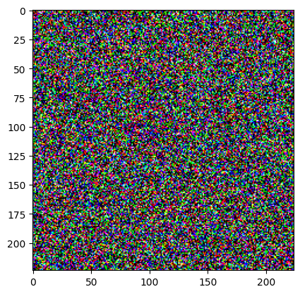
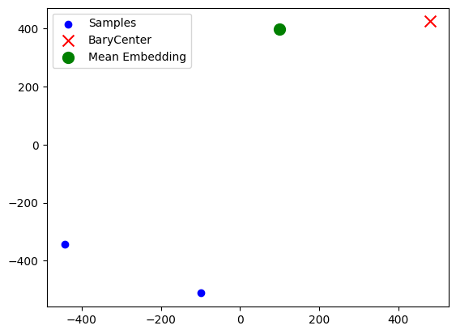

# Load CIFAR10


<!-- WARNING: THIS FILE WAS AUTOGENERATED! DO NOT EDIT! -->

``` python
# import torch
# import os
# from datetime import datetime
# from fastcore.utils import * # type: ignore # noqa: F403
# from fedai.federated.agents import * # noqa: F403
# from fedai.optimizers import *
# from fedai.learner_utils import * # type: ignore # noqa: F403
# from fedai.client_selector import *  # noqa: F403
# from fedai.trainers import *  # noqa: F403
# from fedai.core import get_cfg  # noqa: F401, F403
# from fedai.wandb_writer import *  # noqa: F403
```

``` python
# # from fedai.FLearner import *  # noqa: F403
# from fedai.learner_utils import *  # noqa: F403
# from fedai.utils import * # noqa: F403
# from omegaconf import OmegaConfTrainer

# def cfg_fn(f):
#     cfg = load_config(f)  # noqa: F405
#     cfg = OmegaConf.create(cfg)
#     return cfg
# cfg = cfg_fn('../cfg.yaml')
# # cfg.data.name = 'CIFAR10'
# # cfg.model.name = 'CIFAR10CNN'
# cfg.lr = 0.005
# cfg.local_epochs = 5
# cfg.tau = 0.1
# cfg.model.name
```

    'CIFAR10CNN'

``` python
# from torch import nn
# def client_fn(client_cls, cfg, id, latest_round, t, loss_fn = None, optimizer = None):
    
#     model = get_model(cfg)
#     criterion = get_criterion(loss_fn)

#     train_block = get_block(cfg, id)
#     test_block = get_block(cfg, id, train=False)    
    
#     state = {'model': model, 'optimizer': None, 'criterion': criterion, 't': t}
    
#     if t > 1:
#         state = load_state_from_disk(cfg, state, latest_round, id, t)  # noqa: F405
    
#     state['optimizer'] = SophiaG(state['model'].parameters(),
#                              lr=0.00002,
#                              betas=(0.965, 0.99),
#                              rho=0.01,
#                              weight_decay=1e-1)
        
#     return client_cls(id, cfg, state, block= [train_block, test_block])
```

``` python
# from fedai.FLearner import FLearner

# learner = FLearner(cfg, 
#                    client_fn= client_fn, 
#                    client_cls= FLAgent, 
#                    trainer= FedSophiaTrainer)
```

    wandb: Using wandb-core as the SDK backend.  Please refer to https://wandb.me/wandb-core for more information.
    wandb: Currently logged in as: ahmed-elbakary (edge-ai-team). Use `wandb login --relogin` to force relogin
    wandb: WARNING If you're specifying your api key in code, ensure this code is not shared publicly.
    wandb: WARNING Consider setting the WANDB_API_KEY environment variable, or running `wandb login` from the command line.
    wandb: Appending key for api.wandb.ai to your netrc file: /home/ahmed/.netrc

Tracking run with wandb version 0.19.1

Run data is saved locally in <code>/home/ahmed/Ahmed-home/1- Projects/fedai/nbs/examples/my_examples/wandb/run-20250305_134638-edfimf9m</code>

Syncing run <strong><a href='https://wandb.ai/edge-ai-team/example_project/runs/edfimf9m' target="_blank">example_project20250305_134637</a></strong> to <a href='https://wandb.ai/edge-ai-team/example_project' target="_blank">Weights & Biases</a> (<a href='https://wandb.me/developer-guide' target="_blank">docs</a>)<br>

 View project at <a href='https://wandb.ai/edge-ai-team/example_project' target="_blank">https://wandb.ai/edge-ai-team/example_project</a>

 View run at <a href='https://wandb.ai/edge-ai-team/example_project/runs/edfimf9m' target="_blank">https://wandb.ai/edge-ai-team/example_project/runs/edfimf9m</a>

``` python
# learner.run_simulation()
```

    data/CIFAR10/train data/CIFAR10/test

    Dataset already generated.

    data/CIFAR10/train data/CIFAR10/test

    Dataset already generated.

      0%|          | 0/83 [00:01<?, ?it/s]

    KeyboardInterrupt: 
    ---------------------------------------------------------------------------
    FileNotFoundError                         Traceback (most recent call last)
    File ~/miniconda3/envs/fedai/lib/python3.10/site-packages/evaluate/loading.py:479, in HubEvaluationModuleFactory.get_module(self)
        478 try:
    --> 479     local_path = self.download_loading_script(revision)
        480 except FileNotFoundError as err:
        481     # if there is no file found with current revision tag try to load main

    File ~/miniconda3/envs/fedai/lib/python3.10/site-packages/evaluate/loading.py:469, in HubEvaluationModuleFactory.download_loading_script(self, revision)
        468     download_config.download_desc = "Downloading builder script"
    --> 469 return cached_path(file_path, download_config=download_config)

    File ~/miniconda3/envs/fedai/lib/python3.10/site-packages/evaluate/utils/file_utils.py:175, in cached_path(url_or_filename, download_config, **download_kwargs)
        173 if is_remote_url(url_or_filename):
        174     # URL, so get it from the cache (downloading if necessary)
    --> 175     output_path = get_from_cache(
        176         url_or_filename,
        177         cache_dir=cache_dir,
        178         force_download=download_config.force_download,
        179         proxies=download_config.proxies,
        180         resume_download=download_config.resume_download,
        181         user_agent=download_config.user_agent,
        182         local_files_only=download_config.local_files_only,
        183         use_etag=download_config.use_etag,
        184         max_retries=download_config.max_retries,
        185         token=download_config.token,
        186         download_desc=download_config.download_desc,
        187     )
        188 elif os.path.exists(url_or_filename):
        189     # File, and it exists.

    File ~/miniconda3/envs/fedai/lib/python3.10/site-packages/evaluate/utils/file_utils.py:511, in get_from_cache(url, cache_dir, force_download, proxies, etag_timeout, resume_download, user_agent, local_files_only, use_etag, max_retries, token, download_desc)
        510 elif response is not None and response.status_code == 404:
    --> 511     raise FileNotFoundError(f"Couldn't find file at {url}")
        512 _raise_if_offline_mode_is_enabled(f"Tried to reach {url}")

    FileNotFoundError: Couldn't find file at https://huggingface.co/spaces/evaluate-metric/accuracy/resolve/v0.4.3/accuracy.py

    During handling of the above exception, another exception occurred:

    KeyboardInterrupt                         Traceback (most recent call last)
    Cell In[5], line 1
    ----> 1 learner.run_simulation() 

    File ~/Ahmed-home/1- Projects/fedai/fedai/FLearner.py:67, in run_simulation(self)
         64 self.server.communicate(client) 
         66 trainer = self.trainer(client) 
    ---> 67 client_history = trainer.fit() 
         68 round_res.append(client_history)
         69 res.append(round_res)

    File ~/Ahmed-home/1- Projects/fedai/fedai/trainers.py:139, in fit(self)
        136 train_loss.append(avg_train_loss)
        137 train_metrics.append(metrics_train)
    --> 139 avg_test_loss, metrics_test = self.test()
        140 test_loss.append(avg_test_loss)   
        141 test_metrics.append(metrics_test)

    File ~/Ahmed-home/1- Projects/fedai/fedai/trainers.py:184, in test(self)
        181 if num_eval == 0:
        182     num_eval = 1e-10
    --> 184 loss, metrics = self._closure(batch)                 
        186 # print(f"Client {self.client.id}'s Batch loss inside eval() : {loss}")
        188 if (not torch.isnan(loss)) and (self.cfg.model.grad_norm_clip <= 0 or loss != 0.0):

    File ~/Ahmed-home/1- Projects/fedai/fedai/trainers.py:62, in _closure(self, batch)
         60         metrcis = self.training_metrics.compute(y_pred= y_pred, y_true= y_true, tokenizer= self.client.tokenizer)
         61     else:
    ---> 62         metrcis = self.training_metrics.compute(y_pred= y_pred, y_true= y_true)
         64 else:
         65     metrcis = {k: 0 for k in self.training_metrics}

    File ~/Ahmed-home/1- Projects/fedai/fedai/metrics.py:48, in compute(self, y_true, y_pred, tokenizer, **kwargs)
         46 @patch
         47 def compute(self: Metrics, y_true, y_pred, tokenizer= None,  **kwargs):
    ---> 48     self.metrics = evaluate.combine(self.metrics_names)
         49     if tokenizer:
         50         y_true, y_pred = self.prepare_targets_llm(y_true, y_pred, tokenizer)

    File ~/miniconda3/envs/fedai/lib/python3.10/site-packages/evaluate/module.py:1034, in combine(evaluations, force_prefix)
       1008 def combine(evaluations, force_prefix=False):
       1009     """Combines several metrics, comparisons, or measurements into a single `CombinedEvaluations` object that
       1010     can be used like a single evaluation module.
       1011 
       (...)
       1031     ```
       1032     """
    -> 1034     return CombinedEvaluations(evaluations, force_prefix=force_prefix)

    File ~/miniconda3/envs/fedai/lib/python3.10/site-packages/evaluate/module.py:886, in CombinedEvaluations.__init__(self, evaluation_modules, force_prefix)
        884 for module in self.evaluation_modules:
        885     if isinstance(module, str):
    --> 886         module = load(module)
        887     loaded_modules.append(module)
        888 self.evaluation_modules = loaded_modules

    File ~/miniconda3/envs/fedai/lib/python3.10/site-packages/evaluate/loading.py:748, in load(path, config_name, module_type, process_id, num_process, cache_dir, experiment_id, keep_in_memory, download_config, download_mode, revision, **init_kwargs)
        703 """Load a [`~evaluate.EvaluationModule`].
        704 
        705 Args:
       (...)
        745     ```
        746 """
        747 download_mode = DownloadMode(download_mode or DownloadMode.REUSE_DATASET_IF_EXISTS)
    --> 748 evaluation_module = evaluation_module_factory(
        749     path, module_type=module_type, revision=revision, download_config=download_config, download_mode=download_mode
        750 )
        751 evaluation_cls = import_main_class(evaluation_module.module_path)
        752 evaluation_instance = evaluation_cls(
        753     config_name=config_name,
        754     process_id=process_id,
       (...)
        760     **init_kwargs,
        761 )

    File ~/miniconda3/envs/fedai/lib/python3.10/site-packages/evaluate/loading.py:639, in evaluation_module_factory(path, module_type, revision, download_config, download_mode, force_local_path, dynamic_modules_path, **download_kwargs)
        631 for current_type in ["metric", "comparison", "measurement"]:
        632     try:
        633         return HubEvaluationModuleFactory(
        634             f"evaluate-{current_type}/{path}",
        635             revision=revision,
        636             download_config=download_config,
        637             download_mode=download_mode,
        638             dynamic_modules_path=dynamic_modules_path,
    --> 639         ).get_module()
        640     except ConnectionError:
        641         pass

    File ~/miniconda3/envs/fedai/lib/python3.10/site-packages/evaluate/loading.py:484, in HubEvaluationModuleFactory.get_module(self)
        482 if self.revision is None and os.getenv("HF_SCRIPTS_VERSION", SCRIPTS_VERSION) != "main":
        483     revision = "main"
    --> 484     local_path = self.download_loading_script(revision)
        485 else:
        486     raise err

    File ~/miniconda3/envs/fedai/lib/python3.10/site-packages/evaluate/loading.py:469, in HubEvaluationModuleFactory.download_loading_script(self, revision)
        467 if download_config.download_desc is None:
        468     download_config.download_desc = "Downloading builder script"
    --> 469 return cached_path(file_path, download_config=download_config)

    File ~/miniconda3/envs/fedai/lib/python3.10/site-packages/evaluate/utils/file_utils.py:175, in cached_path(url_or_filename, download_config, **download_kwargs)
        171     url_or_filename = str(url_or_filename)
        173 if is_remote_url(url_or_filename):
        174     # URL, so get it from the cache (downloading if necessary)
    --> 175     output_path = get_from_cache(
        176         url_or_filename,
        177         cache_dir=cache_dir,
        178         force_download=download_config.force_download,
        179         proxies=download_config.proxies,
        180         resume_download=download_config.resume_download,
        181         user_agent=download_config.user_agent,
        182         local_files_only=download_config.local_files_only,
        183         use_etag=download_config.use_etag,
        184         max_retries=download_config.max_retries,
        185         token=download_config.token,
        186         download_desc=download_config.download_desc,
        187     )
        188 elif os.path.exists(url_or_filename):
        189     # File, and it exists.
        190     output_path = url_or_filename

    File ~/miniconda3/envs/fedai/lib/python3.10/site-packages/evaluate/utils/file_utils.py:457, in get_from_cache(url, cache_dir, force_download, proxies, etag_timeout, resume_download, user_agent, local_files_only, use_etag, max_retries, token, download_desc)
        455     connected = ftp_head(url)
        456 try:
    --> 457     response = http_head(
        458         url,
        459         allow_redirects=True,
        460         proxies=proxies,
        461         timeout=etag_timeout,
        462         max_retries=max_retries,
        463         headers=headers,
        464     )
        465     if response.status_code == 200:  # ok
        466         etag = response.headers.get("ETag") if use_etag else None

    File ~/miniconda3/envs/fedai/lib/python3.10/site-packages/evaluate/utils/file_utils.py:378, in http_head(url, proxies, headers, cookies, allow_redirects, timeout, max_retries)
        376 headers = copy.deepcopy(headers) or {}
        377 headers["user-agent"] = get_datasets_user_agent(user_agent=headers.get("user-agent"))
    --> 378 response = _request_with_retry(
        379     method="HEAD",
        380     url=url,
        381     proxies=proxies,
        382     headers=headers,
        383     cookies=cookies,
        384     allow_redirects=allow_redirects,
        385     timeout=timeout,
        386     max_retries=max_retries,
        387 )
        388 return response

    File ~/miniconda3/envs/fedai/lib/python3.10/site-packages/evaluate/utils/file_utils.py:307, in _request_with_retry(method, url, max_retries, base_wait_time, max_wait_time, timeout, **params)
        305 tries += 1
        306 try:
    --> 307     response = requests.request(method=method.upper(), url=url, timeout=timeout, **params)
        308     success = True
        309 except (requests.exceptions.ConnectTimeout, requests.exceptions.ConnectionError) as err:

    File ~/miniconda3/envs/fedai/lib/python3.10/site-packages/requests/api.py:59, in request(method, url, **kwargs)
         55 # By using the 'with' statement we are sure the session is closed, thus we
         56 # avoid leaving sockets open which can trigger a ResourceWarning in some
         57 # cases, and look like a memory leak in others.
         58 with sessions.Session() as session:
    ---> 59     return session.request(method=method, url=url, **kwargs)

    File ~/miniconda3/envs/fedai/lib/python3.10/site-packages/requests/sessions.py:589, in Session.request(self, method, url, params, data, headers, cookies, files, auth, timeout, allow_redirects, proxies, hooks, stream, verify, cert, json)
        584 send_kwargs = {
        585     "timeout": timeout,
        586     "allow_redirects": allow_redirects,
        587 }
        588 send_kwargs.update(settings)
    --> 589 resp = self.send(prep, **send_kwargs)
        591 return resp

    File ~/miniconda3/envs/fedai/lib/python3.10/site-packages/requests/sessions.py:703, in Session.send(self, request, **kwargs)
        700 start = preferred_clock()
        702 # Send the request
    --> 703 r = adapter.send(request, **kwargs)
        705 # Total elapsed time of the request (approximately)
        706 elapsed = preferred_clock() - start

    File ~/miniconda3/envs/fedai/lib/python3.10/site-packages/requests/adapters.py:667, in HTTPAdapter.send(self, request, stream, timeout, verify, cert, proxies)
        664     timeout = TimeoutSauce(connect=timeout, read=timeout)
        666 try:
    --> 667     resp = conn.urlopen(
        668         method=request.method,
        669         url=url,
        670         body=request.body,
        671         headers=request.headers,
        672         redirect=False,
        673         assert_same_host=False,
        674         preload_content=False,
        675         decode_content=False,
        676         retries=self.max_retries,
        677         timeout=timeout,
        678         chunked=chunked,
        679     )
        681 except (ProtocolError, OSError) as err:
        682     raise ConnectionError(err, request=request)

    File ~/miniconda3/envs/fedai/lib/python3.10/site-packages/urllib3/connectionpool.py:789, in HTTPConnectionPool.urlopen(self, method, url, body, headers, retries, redirect, assert_same_host, timeout, pool_timeout, release_conn, chunked, body_pos, preload_content, decode_content, **response_kw)
        786 response_conn = conn if not release_conn else None
        788 # Make the request on the HTTPConnection object
    --> 789 response = self._make_request(
        790     conn,
        791     method,
        792     url,
        793     timeout=timeout_obj,
        794     body=body,
        795     headers=headers,
        796     chunked=chunked,
        797     retries=retries,
        798     response_conn=response_conn,
        799     preload_content=preload_content,
        800     decode_content=decode_content,
        801     **response_kw,
        802 )
        804 # Everything went great!
        805 clean_exit = True

    File ~/miniconda3/envs/fedai/lib/python3.10/site-packages/urllib3/connectionpool.py:466, in HTTPConnectionPool._make_request(self, conn, method, url, body, headers, retries, timeout, chunked, response_conn, preload_content, decode_content, enforce_content_length)
        463 try:
        464     # Trigger any extra validation we need to do.
        465     try:
    --> 466         self._validate_conn(conn)
        467     except (SocketTimeout, BaseSSLError) as e:
        468         self._raise_timeout(err=e, url=url, timeout_value=conn.timeout)

    File ~/miniconda3/envs/fedai/lib/python3.10/site-packages/urllib3/connectionpool.py:1095, in HTTPSConnectionPool._validate_conn(self, conn)
       1093 # Force connect early to allow us to validate the connection.
       1094 if conn.is_closed:
    -> 1095     conn.connect()
       1097 # TODO revise this, see https://github.com/urllib3/urllib3/issues/2791
       1098 if not conn.is_verified and not conn.proxy_is_verified:

    File ~/miniconda3/envs/fedai/lib/python3.10/site-packages/urllib3/connection.py:730, in HTTPSConnection.connect(self)
        727     # Remove trailing '.' from fqdn hostnames to allow certificate validation
        728     server_hostname_rm_dot = server_hostname.rstrip(".")
    --> 730     sock_and_verified = _ssl_wrap_socket_and_match_hostname(
        731         sock=sock,
        732         cert_reqs=self.cert_reqs,
        733         ssl_version=self.ssl_version,
        734         ssl_minimum_version=self.ssl_minimum_version,
        735         ssl_maximum_version=self.ssl_maximum_version,
        736         ca_certs=self.ca_certs,
        737         ca_cert_dir=self.ca_cert_dir,
        738         ca_cert_data=self.ca_cert_data,
        739         cert_file=self.cert_file,
        740         key_file=self.key_file,
        741         key_password=self.key_password,
        742         server_hostname=server_hostname_rm_dot,
        743         ssl_context=self.ssl_context,
        744         tls_in_tls=tls_in_tls,
        745         assert_hostname=self.assert_hostname,
        746         assert_fingerprint=self.assert_fingerprint,
        747     )
        748     self.sock = sock_and_verified.socket
        750 # If an error occurs during connection/handshake we may need to release
        751 # our lock so another connection can probe the origin.

    File ~/miniconda3/envs/fedai/lib/python3.10/site-packages/urllib3/connection.py:909, in _ssl_wrap_socket_and_match_hostname(sock, cert_reqs, ssl_version, ssl_minimum_version, ssl_maximum_version, cert_file, key_file, key_password, ca_certs, ca_cert_dir, ca_cert_data, assert_hostname, assert_fingerprint, server_hostname, ssl_context, tls_in_tls)
        906     if is_ipaddress(normalized):
        907         server_hostname = normalized
    --> 909 ssl_sock = ssl_wrap_socket(
        910     sock=sock,
        911     keyfile=key_file,
        912     certfile=cert_file,
        913     key_password=key_password,
        914     ca_certs=ca_certs,
        915     ca_cert_dir=ca_cert_dir,
        916     ca_cert_data=ca_cert_data,
        917     server_hostname=server_hostname,
        918     ssl_context=context,
        919     tls_in_tls=tls_in_tls,
        920 )
        922 try:
        923     if assert_fingerprint:

    File ~/miniconda3/envs/fedai/lib/python3.10/site-packages/urllib3/util/ssl_.py:469, in ssl_wrap_socket(sock, keyfile, certfile, cert_reqs, ca_certs, server_hostname, ssl_version, ciphers, ssl_context, ca_cert_dir, key_password, ca_cert_data, tls_in_tls)
        465         context.load_cert_chain(certfile, keyfile, key_password)
        467 context.set_alpn_protocols(ALPN_PROTOCOLS)
    --> 469 ssl_sock = _ssl_wrap_socket_impl(sock, context, tls_in_tls, server_hostname)
        470 return ssl_sock

    File ~/miniconda3/envs/fedai/lib/python3.10/site-packages/urllib3/util/ssl_.py:513, in _ssl_wrap_socket_impl(sock, ssl_context, tls_in_tls, server_hostname)
        510     SSLTransport._validate_ssl_context_for_tls_in_tls(ssl_context)
        511     return SSLTransport(sock, ssl_context, server_hostname)
    --> 513 return ssl_context.wrap_socket(sock, server_hostname=server_hostname)

    File ~/miniconda3/envs/fedai/lib/python3.10/ssl.py:513, in SSLContext.wrap_socket(self, sock, server_side, do_handshake_on_connect, suppress_ragged_eofs, server_hostname, session)
        507 def wrap_socket(self, sock, server_side=False,
        508                 do_handshake_on_connect=True,
        509                 suppress_ragged_eofs=True,
        510                 server_hostname=None, session=None):
        511     # SSLSocket class handles server_hostname encoding before it calls
        512     # ctx._wrap_socket()
    --> 513     return self.sslsocket_class._create(
        514         sock=sock,
        515         server_side=server_side,
        516         do_handshake_on_connect=do_handshake_on_connect,
        517         suppress_ragged_eofs=suppress_ragged_eofs,
        518         server_hostname=server_hostname,
        519         context=self,
        520         session=session
        521     )

    File ~/miniconda3/envs/fedai/lib/python3.10/ssl.py:1104, in SSLSocket._create(cls, sock, server_side, do_handshake_on_connect, suppress_ragged_eofs, server_hostname, context, session)
       1101         if timeout == 0.0:
       1102             # non-blocking
       1103             raise ValueError("do_handshake_on_connect should not be specified for non-blocking sockets")
    -> 1104         self.do_handshake()
       1105 except (OSError, ValueError):
       1106     self.close()

    File ~/miniconda3/envs/fedai/lib/python3.10/ssl.py:1375, in SSLSocket.do_handshake(self, block)
       1373     if timeout == 0.0 and block:
       1374         self.settimeout(None)
    -> 1375     self._sslobj.do_handshake()
       1376 finally:
       1377     self.settimeout(timeout)

    KeyboardInterrupt: 

    Error in callback <bound method _WandbInit._pause_backend of <wandb.sdk.wandb_init._WandbInit object>> (for post_run_cell), with arguments args (<ExecutionResult object at 7fe5f2577b80, execution_count=5 error_before_exec=None error_in_exec= info=<ExecutionInfo object at 7fe4f5082b30, raw_cell="learner.run_simulation() " store_history=True silent=False shell_futures=True cell_id=vscode-notebook-cell:/home/ahmed/Ahmed-home/1-%20Projects/fedai/nbs/examples/my_examples/observer.ipynb#W5sZmlsZQ%3D%3D> result=None>,),kwargs {}:

    BrokenPipeError: [Errno 32] Broken pipe
    ---------------------------------------------------------------------------
    BrokenPipeError                           Traceback (most recent call last)
    File ~/miniconda3/envs/fedai/lib/python3.10/site-packages/wandb/sdk/wandb_init.py:440, in _WandbInit._pause_backend(self, *args, **kwargs)
        438 if self.backend.interface is not None:
        439     logger.info("pausing backend")  # type: ignore
    --> 440     self.backend.interface.publish_pause()

    File ~/miniconda3/envs/fedai/lib/python3.10/site-packages/wandb/sdk/interface/interface.py:756, in InterfaceBase.publish_pause(self)
        754 def publish_pause(self) -> None:
        755     pause = pb.PauseRequest()
    --> 756     self._publish_pause(pause)

    File ~/miniconda3/envs/fedai/lib/python3.10/site-packages/wandb/sdk/interface/interface_shared.py:362, in InterfaceShared._publish_pause(self, pause)
        360 def _publish_pause(self, pause: pb.PauseRequest) -> None:
        361     rec = self._make_request(pause=pause)
    --> 362     self._publish(rec)

    File ~/miniconda3/envs/fedai/lib/python3.10/site-packages/wandb/sdk/interface/interface_sock.py:51, in InterfaceSock._publish(self, record, local)
         49 def _publish(self, record: "pb.Record", local: Optional[bool] = None) -> None:
         50     self._assign(record)
    ---> 51     self._sock_client.send_record_publish(record)

    File ~/miniconda3/envs/fedai/lib/python3.10/site-packages/wandb/sdk/lib/sock_client.py:222, in SockClient.send_record_publish(self, record)
        220 server_req = spb.ServerRequest()
        221 server_req.record_publish.CopyFrom(record)
    --> 222 self.send_server_request(server_req)

    File ~/miniconda3/envs/fedai/lib/python3.10/site-packages/wandb/sdk/lib/sock_client.py:154, in SockClient.send_server_request(self, msg)
        153 def send_server_request(self, msg: Any) -> None:
    --> 154     self._send_message(msg)

    File ~/miniconda3/envs/fedai/lib/python3.10/site-packages/wandb/sdk/lib/sock_client.py:151, in SockClient._send_message(self, msg)
        149 header = struct.pack("<BI", ord("W"), raw_size)
        150 with self._lock:
    --> 151     self._sendall_with_error_handle(header + data)

    File ~/miniconda3/envs/fedai/lib/python3.10/site-packages/wandb/sdk/lib/sock_client.py:130, in SockClient._sendall_with_error_handle(self, data)
        128 start_time = time.monotonic()
        129 try:
    --> 130     sent = self._sock.send(data)
        131     # sent equal to 0 indicates a closed socket
        132     if sent == 0:

    BrokenPipeError: [Errno 32] Broken pipe

``` python
# import wandb
# wandb.finish()
```

    Error in callback <bound method _WandbInit._resume_backend of <wandb.sdk.wandb_init._WandbInit object>> (for pre_run_cell), with arguments args (<ExecutionInfo object at 7fe4ddd05ff0, raw_cell="import wandb
    wandb.finish()" store_history=True silent=False shell_futures=True cell_id=vscode-notebook-cell:/home/ahmed/Ahmed-home/1-%20Projects/fedai/nbs/examples/my_examples/observer.ipynb#W6sZmlsZQ%3D%3D>,),kwargs {}:

    BrokenPipeError: [Errno 32] Broken pipe
    ---------------------------------------------------------------------------
    BrokenPipeError                           Traceback (most recent call last)
    File ~/miniconda3/envs/fedai/lib/python3.10/site-packages/wandb/sdk/wandb_init.py:445, in _WandbInit._resume_backend(self, *args, **kwargs)
        443 if self.backend is not None and self.backend.interface is not None:
        444     logger.info("resuming backend")  # type: ignore
    --> 445     self.backend.interface.publish_resume()

    File ~/miniconda3/envs/fedai/lib/python3.10/site-packages/wandb/sdk/interface/interface.py:764, in InterfaceBase.publish_resume(self)
        762 def publish_resume(self) -> None:
        763     resume = pb.ResumeRequest()
    --> 764     self._publish_resume(resume)

    File ~/miniconda3/envs/fedai/lib/python3.10/site-packages/wandb/sdk/interface/interface_shared.py:366, in InterfaceShared._publish_resume(self, resume)
        364 def _publish_resume(self, resume: pb.ResumeRequest) -> None:
        365     rec = self._make_request(resume=resume)
    --> 366     self._publish(rec)

    File ~/miniconda3/envs/fedai/lib/python3.10/site-packages/wandb/sdk/interface/interface_sock.py:51, in InterfaceSock._publish(self, record, local)
         49 def _publish(self, record: "pb.Record", local: Optional[bool] = None) -> None:
         50     self._assign(record)
    ---> 51     self._sock_client.send_record_publish(record)

    File ~/miniconda3/envs/fedai/lib/python3.10/site-packages/wandb/sdk/lib/sock_client.py:222, in SockClient.send_record_publish(self, record)
        220 server_req = spb.ServerRequest()
        221 server_req.record_publish.CopyFrom(record)
    --> 222 self.send_server_request(server_req)

    File ~/miniconda3/envs/fedai/lib/python3.10/site-packages/wandb/sdk/lib/sock_client.py:154, in SockClient.send_server_request(self, msg)
        153 def send_server_request(self, msg: Any) -> None:
    --> 154     self._send_message(msg)

    File ~/miniconda3/envs/fedai/lib/python3.10/site-packages/wandb/sdk/lib/sock_client.py:151, in SockClient._send_message(self, msg)
        149 header = struct.pack("<BI", ord("W"), raw_size)
        150 with self._lock:
    --> 151     self._sendall_with_error_handle(header + data)

    File ~/miniconda3/envs/fedai/lib/python3.10/site-packages/wandb/sdk/lib/sock_client.py:130, in SockClient._sendall_with_error_handle(self, data)
        128 start_time = time.monotonic()
        129 try:
    --> 130     sent = self._sock.send(data)
        131     # sent equal to 0 indicates a closed socket
        132     if sent == 0:

    BrokenPipeError: [Errno 32] Broken pipe

    BrokenPipeError: [Errno 32] Broken pipe
    ---------------------------------------------------------------------------
    BrokenPipeError                           Traceback (most recent call last)
    Cell In[6], line 2
          1 import wandb
    ----> 2 wandb.finish()

    File ~/miniconda3/envs/fedai/lib/python3.10/site-packages/wandb/sdk/wandb_run.py:4066, in finish(exit_code, quiet)
       4049 """Finish a run and upload any remaining data.
       4050 
       4051 Marks the completion of a W&B run and ensures all data is synced to the server.
       (...)
       4063     quiet: Deprecated. Configure logging verbosity using `wandb.Settings(quiet=...)`.
       4064 """
       4065 if wandb.run:
    -> 4066     wandb.run.finish(exit_code=exit_code, quiet=quiet)

    File ~/miniconda3/envs/fedai/lib/python3.10/site-packages/wandb/sdk/wandb_run.py:440, in _run_decorator._noop.<locals>.wrapper(self, *args, **kwargs)
        437         wandb.termwarn(message, repeat=False)
        438         return cls.Dummy()
    --> 440 return func(self, *args, **kwargs)

    File ~/miniconda3/envs/fedai/lib/python3.10/site-packages/wandb/sdk/wandb_run.py:382, in _run_decorator._attach.<locals>.wrapper(self, *args, **kwargs)
        380         raise e
        381     cls._is_attaching = ""
    --> 382 return func(self, *args, **kwargs)

    File ~/miniconda3/envs/fedai/lib/python3.10/site-packages/wandb/sdk/wandb_run.py:2094, in Run.finish(self, exit_code, quiet)
       2086 if quiet is not None:
       2087     deprecate.deprecate(
       2088         field_name=deprecate.Deprecated.run__finish_quiet,
       2089         warning_message=(
       (...)
       2092         ),
       2093     )
    -> 2094 return self._finish(exit_code)

    File ~/miniconda3/envs/fedai/lib/python3.10/site-packages/wandb/sdk/wandb_run.py:2101, in Run._finish(self, exit_code)
       2096 def _finish(
       2097     self,
       2098     exit_code: int | None = None,
       2099 ) -> None:
       2100     logger.info(f"finishing run {self._get_path()}")
    -> 2101     with telemetry.context(run=self) as tel:
       2102         tel.feature.finish = True
       2104     # Pop this run (hopefully) from the run stack, to support the "reinit"
       2105     # functionality of wandb.init().
       2106     #
       2107     # TODO: It's not clear how _global_run_stack could have length other
       2108     # than 1 at this point in the code. If you're reading this, consider
       2109     # refactoring this thing.

    File ~/miniconda3/envs/fedai/lib/python3.10/site-packages/wandb/sdk/lib/telemetry.py:42, in _TelemetryObject.__exit__(self, exctype, excinst, exctb)
         40 if not self._run:
         41     return
    ---> 42 self._run._telemetry_callback(self._obj)

    File ~/miniconda3/envs/fedai/lib/python3.10/site-packages/wandb/sdk/wandb_run.py:767, in Run._telemetry_callback(self, telem_obj)
        765 self._telemetry_obj.MergeFrom(telem_obj)
        766 self._telemetry_obj_dirty = True
    --> 767 self._telemetry_flush()

    File ~/miniconda3/envs/fedai/lib/python3.10/site-packages/wandb/sdk/wandb_run.py:780, in Run._telemetry_flush(self)
        778 if serialized == self._telemetry_obj_flushed:
        779     return
    --> 780 self._backend.interface._publish_telemetry(self._telemetry_obj)
        781 self._telemetry_obj_flushed = serialized
        782 self._telemetry_obj_dirty = False

    File ~/miniconda3/envs/fedai/lib/python3.10/site-packages/wandb/sdk/interface/interface_shared.py:101, in InterfaceShared._publish_telemetry(self, telem)
         99 def _publish_telemetry(self, telem: tpb.TelemetryRecord) -> None:
        100     rec = self._make_record(telemetry=telem)
    --> 101     self._publish(rec)

    File ~/miniconda3/envs/fedai/lib/python3.10/site-packages/wandb/sdk/interface/interface_sock.py:51, in InterfaceSock._publish(self, record, local)
         49 def _publish(self, record: "pb.Record", local: Optional[bool] = None) -> None:
         50     self._assign(record)
    ---> 51     self._sock_client.send_record_publish(record)

    File ~/miniconda3/envs/fedai/lib/python3.10/site-packages/wandb/sdk/lib/sock_client.py:222, in SockClient.send_record_publish(self, record)
        220 server_req = spb.ServerRequest()
        221 server_req.record_publish.CopyFrom(record)
    --> 222 self.send_server_request(server_req)

    File ~/miniconda3/envs/fedai/lib/python3.10/site-packages/wandb/sdk/lib/sock_client.py:154, in SockClient.send_server_request(self, msg)
        153 def send_server_request(self, msg: Any) -> None:
    --> 154     self._send_message(msg)

    File ~/miniconda3/envs/fedai/lib/python3.10/site-packages/wandb/sdk/lib/sock_client.py:151, in SockClient._send_message(self, msg)
        149 header = struct.pack("<BI", ord("W"), raw_size)
        150 with self._lock:
    --> 151     self._sendall_with_error_handle(header + data)

    File ~/miniconda3/envs/fedai/lib/python3.10/site-packages/wandb/sdk/lib/sock_client.py:130, in SockClient._sendall_with_error_handle(self, data)
        128 start_time = time.monotonic()
        129 try:
    --> 130     sent = self._sock.send(data)
        131     # sent equal to 0 indicates a closed socket
        132     if sent == 0:

    BrokenPipeError: [Errno 32] Broken pipe

    Error in callback <bound method _WandbInit._pause_backend of <wandb.sdk.wandb_init._WandbInit object>> (for post_run_cell), with arguments args (<ExecutionResult object at 7fe4ddd058d0, execution_count=6 error_before_exec=None error_in_exec=[Errno 32] Broken pipe info=<ExecutionInfo object at 7fe4ddd05ff0, raw_cell="import wandb
    wandb.finish()" store_history=True silent=False shell_futures=True cell_id=vscode-notebook-cell:/home/ahmed/Ahmed-home/1-%20Projects/fedai/nbs/examples/my_examples/observer.ipynb#W6sZmlsZQ%3D%3D> result=None>,),kwargs {}:

    BrokenPipeError: [Errno 32] Broken pipe
    ---------------------------------------------------------------------------
    BrokenPipeError                           Traceback (most recent call last)
    File ~/miniconda3/envs/fedai/lib/python3.10/site-packages/wandb/sdk/wandb_init.py:440, in _WandbInit._pause_backend(self, *args, **kwargs)
        438 if self.backend.interface is not None:
        439     logger.info("pausing backend")  # type: ignore
    --> 440     self.backend.interface.publish_pause()

    File ~/miniconda3/envs/fedai/lib/python3.10/site-packages/wandb/sdk/interface/interface.py:756, in InterfaceBase.publish_pause(self)
        754 def publish_pause(self) -> None:
        755     pause = pb.PauseRequest()
    --> 756     self._publish_pause(pause)

    File ~/miniconda3/envs/fedai/lib/python3.10/site-packages/wandb/sdk/interface/interface_shared.py:362, in InterfaceShared._publish_pause(self, pause)
        360 def _publish_pause(self, pause: pb.PauseRequest) -> None:
        361     rec = self._make_request(pause=pause)
    --> 362     self._publish(rec)

    File ~/miniconda3/envs/fedai/lib/python3.10/site-packages/wandb/sdk/interface/interface_sock.py:51, in InterfaceSock._publish(self, record, local)
         49 def _publish(self, record: "pb.Record", local: Optional[bool] = None) -> None:
         50     self._assign(record)
    ---> 51     self._sock_client.send_record_publish(record)

    File ~/miniconda3/envs/fedai/lib/python3.10/site-packages/wandb/sdk/lib/sock_client.py:222, in SockClient.send_record_publish(self, record)
        220 server_req = spb.ServerRequest()
        221 server_req.record_publish.CopyFrom(record)
    --> 222 self.send_server_request(server_req)

    File ~/miniconda3/envs/fedai/lib/python3.10/site-packages/wandb/sdk/lib/sock_client.py:154, in SockClient.send_server_request(self, msg)
        153 def send_server_request(self, msg: Any) -> None:
    --> 154     self._send_message(msg)

    File ~/miniconda3/envs/fedai/lib/python3.10/site-packages/wandb/sdk/lib/sock_client.py:151, in SockClient._send_message(self, msg)
        149 header = struct.pack("<BI", ord("W"), raw_size)
        150 with self._lock:
    --> 151     self._sendall_with_error_handle(header + data)

    File ~/miniconda3/envs/fedai/lib/python3.10/site-packages/wandb/sdk/lib/sock_client.py:130, in SockClient._sendall_with_error_handle(self, data)
        128 start_time = time.monotonic()
        129 try:
    --> 130     sent = self._sock.send(data)
        131     # sent equal to 0 indicates a closed socket
        132     if sent == 0:

    BrokenPipeError: [Errno 32] Broken pipe

``` python
# # get mnist from pytorch
# import torch
# import torchvision
# import torchvision.transforms as transforms
# import torch.nn as nn
# import torch.nn.functional as F
# import torch.optim as optim
# import matplotlib.pyplot as plt
# import numpy as np

# # transform PILImage to tensor
# preprocess = transforms.Compose([
#     transforms.Resize(256),
#     transforms.CenterCrop(224),
#     transforms.ToTensor(),
#     transforms.Normalize(mean=[0.485, 0.456, 0.406], std=[0.229, 0.224, 0.225]),
# ])
# # get trainset and testset
# trainset = torchvision.datasets.CIFAR10(root='./data', train=True,
#                                         download=True, transform=preprocess)
# train_loader = torch.utils.data.DataLoader(trainset, batch_size=4,
#                                           shuffle=True, num_workers=2)
# testset = torchvision.datasets.CIFAR10(root='./data', train=False,
#                                         download=True, transform=preprocess)
# test_loader = torch.utils.data.DataLoader(testset, batch_size=4,
#                                         shuffle=False, num_workers=2)

# # get 10 classes    
# classes = ('0', '1', '2', '3', '4',
#            '5', '6', '7', '8', '9')
```

    Files already downloaded and verified
    Files already downloaded and verified

# Models

``` python
# # deefine resnet without the classifer
# from torchvision import models
# resnet18 = models.resnet18(pretrained=True)
# model = torch.nn.Sequential(*list(resnet18.children())[:-1])
```

    /usr/local/lib/python3.10/dist-packages/torchvision/models/_utils.py:208: UserWarning: The parameter 'pretrained' is deprecated since 0.13 and may be removed in the future, please use 'weights' instead.
      warnings.warn(
    /usr/local/lib/python3.10/dist-packages/torchvision/models/_utils.py:223: UserWarning: Arguments other than a weight enum or `None` for 'weights' are deprecated since 0.13 and may be removed in the future. The current behavior is equivalent to passing `weights=ResNet18_Weights.IMAGENET1K_V1`. You can also use `weights=ResNet18_Weights.DEFAULT` to get the most up-to-date weights.
      warnings.warn(msg)
    Downloading: "https://download.pytorch.org/models/resnet18-f37072fd.pth" to /root/.cache/torch/hub/checkpoints/resnet18-f37072fd.pth
    100%|██████████| 44.7M/44.7M [00:00<00:00, 205MB/s]

``` python
# class SimpleMLP(nn.Module):
#     def __init__(self):
#         super(SimpleMLP, self).__init__()

#         # First fully connected block
#         self.fc1 = nn.Linear(512, 256)  # Input size of 128 (features from CNN output or other input)
#         self.relu1 = nn.ReLU()

#         # Second fully connected block
#         self.fc2 = nn.Linear(256, 256)
#         self.relu2 = nn.ReLU()

#         # Final output layer
#         self.fc3 = nn.Linear(256, 512)  # Smaller output for feature learning

#     def forward(self, x):
#         x = self.relu1(self.fc1(x))
#         x = self.relu2(self.fc2(x))
#         x = self.fc3(x)
#         return x
```

``` python
# import torch
# import torch.nn as nn

# class ImprovedMLP(nn.Module):
#     def __init__(self):
#         super(ImprovedMLP, self).__init__()

#         # First fully connected block with BatchNorm and Dropout
#         self.fc1 = nn.Linear(512, 256)
#         self.bn1 = nn.BatchNorm1d(256)  # Batch Normalization
#         self.act1 = nn.ReLU()  # Swish activation
#         self.drop1 = nn.Dropout(0.2)  # Regularization

#         # Second fully connected block with a residual connection
#         self.fc2 = nn.Linear(256, 256)
#         self.bn2 = nn.BatchNorm1d(256)
#         self.act2 = nn.ReLU()
#         self.drop2 = nn.Dropout(0.2)

#         # Final output layer
#         self.fc3 = nn.Linear(256, 512)

#     def forward(self, x):
#         residual = x  # Store original input for residual connection
        
#         x = self.fc1(x)
#         x = self.bn1(x)
#         x = self.act1(x)
#         x = self.drop1(x)

#         x = self.fc2(x)
#         x = self.bn2(x)
#         x = self.act2(x)
#         x = self.drop2(x)

#         x = self.fc3(x)
#         x = x + residual  # Residual connection

#         return x
```

``` python
# class LSTM_h(nn.Module):
#     def __init__(self):
#         super(LSTM_h, self).__init__()
#         self.lstm = nn.LSTM(512, 512, 1)
#         self.fc = nn.Linear(512, 512)
#     def forward(self, x):
#         x = x.view(-1, 512, 1)
#         x, _ = self.lstm(x)
#         x = x[-1, :, :]
#         x = self.fc(x)
#         return x
```

``` python
# observer = ImprovedMLP()
# observer = observer.to('cuda')
# model = model.to('cuda')
```

# States Dataset

``` python
# image_index_map = {i: trainset[i][0] for i in range(len(trainset))}  # Maps idx → image tensor
```

``` python
# import os
# # Define loss and optimizer
# criterion = nn.CrossEntropyLoss()
# optimizer = optim.Adam(resnet18.parameters(), lr=0.001)

# # Directory to store features
# os.makedirs("features", exist_ok=True)

# # Training loop with feature tracking
# num_epochs = 10
# for epoch in range(num_epochs):
#     resnet18.train()
    
#     for images, labels in train_loader:
#         images, labels = images.to("cuda"), labels.to("cuda")

#         # Forward pass
#         outputs = resnet18(images)
#         loss = criterion(outputs, labels)

#         # Backward and optimize
#         optimizer.zero_grad()
#         loss.backward()
#         optimizer.step()

#     # Extract features at this epoch for each image
#     resnet18.eval()
#     with torch.no_grad():
#         with open(f"features/epoch_{epoch}.pt", "wb") as f:
#             feature_dict = {}  # Store features temporarily
#             for img_idx in range(len(trainset)):  # Process each image separately
#                 image, _ = trainset[img_idx]  # Load image dynamically
#                 image = image.unsqueeze(0).to("cuda")  # Add batch dimension
#                 feature = trainset(image).squeeze().cpu()  # Shape: (512,)
#                 feature_dict[img_idx] = feature  # Store feature
#             torch.save(feature_dict, f)  # Save features for the current epoch

#     print(f"Epoch [{epoch+1}/{num_epochs}] completed. Features saved.")
```

``` python
#
```

``` python
# # create a data set of all consecutive hiiden states and make it memry efficient

# class FeatureDataset(torch.utils.data.Dataset):
#     def __init__(self, model, data_loader):
#         self.model = model
#         self.model.eval()
#         self.data_loader = data_loader

#     def __len__(self):
#         return len(self.data_loader.dataset) - 1

#     def __getitem__(self, idx):
#         with torch.no_grad():
#             data, _ = self.data_loader.dataset[idx]
#             d2, _ = self.data_loader.dataset[idx+1]
#             h1 = self.model(data.to('cuda').unsqueeze(0)).view(-1)
#             h2 = self.model(d2.to('cuda').unsqueeze(0)).view(-1)
#             return h1, h2
```

``` python
# ds_train = FeatureDataset(model, trainloader)
# dl_train = torch.utils.data.DataLoader(ds_train, batch_size=32, shuffle=True)

# ds_test = FeatureDataset(model, testloader)
# dl_test = torch.utils.data.DataLoader(ds_test, batch_size=32, shuffle=True)
```

``` python
# len(dl_train)
```

    12500

``` python
# !pip install wandb
```

    Requirement already satisfied: wandb in /usr/local/lib/python3.10/dist-packages (0.19.1)
    Requirement already satisfied: click!=8.0.0,>=7.1 in /usr/local/lib/python3.10/dist-packages (from wandb) (8.1.7)
    Requirement already satisfied: docker-pycreds>=0.4.0 in /usr/local/lib/python3.10/dist-packages (from wandb) (0.4.0)
    Requirement already satisfied: gitpython!=3.1.29,>=1.0.0 in /usr/local/lib/python3.10/dist-packages (from wandb) (3.1.43)
    Requirement already satisfied: platformdirs in /usr/local/lib/python3.10/dist-packages (from wandb) (4.3.6)
    Requirement already satisfied: protobuf!=4.21.0,!=5.28.0,<6,>=3.19.0 in /usr/local/lib/python3.10/dist-packages (from wandb) (3.20.3)
    Requirement already satisfied: psutil>=5.0.0 in /usr/local/lib/python3.10/dist-packages (from wandb) (5.9.5)
    Requirement already satisfied: pydantic<3,>=2.6 in /usr/local/lib/python3.10/dist-packages (from wandb) (2.11.0a1)
    Requirement already satisfied: pyyaml in /usr/local/lib/python3.10/dist-packages (from wandb) (6.0.2)
    Requirement already satisfied: requests<3,>=2.0.0 in /usr/local/lib/python3.10/dist-packages (from wandb) (2.32.3)
    Requirement already satisfied: sentry-sdk>=2.0.0 in /usr/local/lib/python3.10/dist-packages (from wandb) (2.19.2)
    Requirement already satisfied: setproctitle in /usr/local/lib/python3.10/dist-packages (from wandb) (1.3.4)
    Requirement already satisfied: setuptools in /usr/local/lib/python3.10/dist-packages (from wandb) (75.1.0)
    Requirement already satisfied: typing-extensions<5,>=4.4 in /usr/local/lib/python3.10/dist-packages (from wandb) (4.12.2)
    Requirement already satisfied: six>=1.4.0 in /usr/local/lib/python3.10/dist-packages (from docker-pycreds>=0.4.0->wandb) (1.17.0)
    Requirement already satisfied: gitdb<5,>=4.0.1 in /usr/local/lib/python3.10/dist-packages (from gitpython!=3.1.29,>=1.0.0->wandb) (4.0.11)
    Requirement already satisfied: annotated-types>=0.6.0 in /usr/local/lib/python3.10/dist-packages (from pydantic<3,>=2.6->wandb) (0.7.0)
    Requirement already satisfied: pydantic-core==2.28.0 in /usr/local/lib/python3.10/dist-packages (from pydantic<3,>=2.6->wandb) (2.28.0)
    Requirement already satisfied: charset-normalizer<4,>=2 in /usr/local/lib/python3.10/dist-packages (from requests<3,>=2.0.0->wandb) (3.4.1)
    Requirement already satisfied: idna<4,>=2.5 in /usr/local/lib/python3.10/dist-packages (from requests<3,>=2.0.0->wandb) (3.10)
    Requirement already satisfied: urllib3<3,>=1.21.1 in /usr/local/lib/python3.10/dist-packages (from requests<3,>=2.0.0->wandb) (2.3.0)
    Requirement already satisfied: certifi>=2017.4.17 in /usr/local/lib/python3.10/dist-packages (from requests<3,>=2.0.0->wandb) (2025.1.31)
    Requirement already satisfied: smmap<6,>=3.0.1 in /usr/local/lib/python3.10/dist-packages (from gitdb<5,>=4.0.1->gitpython!=3.1.29,>=1.0.0->wandb) (5.0.1)

``` python
# import wandb

# wandb.login(key="0c6ac9fee5239a432529a35c7433d121ec9c9f37",
#            verify=True)
```

    wandb: Using wandb-core as the SDK backend.  Please refer to https://wandb.me/wandb-core for more information.
    wandb: Currently logged in as: ahmed-elbakary (edge-ai-team). Use `wandb login --relogin` to force relogin
    wandb: WARNING If you're specifying your api key in code, ensure this code is not shared publicly.
    wandb: WARNING Consider setting the WANDB_API_KEY environment variable, or running `wandb login` from the command line.
    wandb: Appending key for api.wandb.ai to your netrc file: /root/.netrc

    True

``` python
# # train the model

# criterion = nn.MSELoss()
# optimizer = torch.optim.Adam(observer.parameters(), lr=1e-3, weight_decay=1e-5)
# n_epochs = 2

# # start a new wandb run to track this script
# wandb.init(
#     # set the wandb project where this run will be logged
#     project="observer",

#     # track hyperparameters and run metadata
#     config={
#     "learning_rate": 0.0001,
#     "architecture": "MLP",
#     "dataset": "CIFAR10", # first 2000 videos of the dataset
#     "epochs": n_epochs,
#     }
# )

# for epoch in range(n_epochs):  # loop over the dataset multiple times

#     running_loss = 0.0
#     for i, data in enumerate(dl_train):
        
#         # get the inputs; data is a list of [inputs, labels]
#         h, h_next = data

#         # zero the parameter gradients
#         optimizer.zero_grad()

#         # forward + backward + optimize
#         outputs = observer(h.to('cuda'))
#         loss = criterion(outputs, h_next.to('cuda'))
#         loss.backward()
#         optimizer.step()

#         # print statistics
#         running_loss += loss.item()
#         print("here***"*4)
#         if i % 200 == 199:    # print every 2000 mini-batches
#             print('Train: [%d, %5d] loss: %.3f' %
#                   (epoch + 1, i + 1, running_loss / 200))
#             avg_train_loss = running_loss / 200
#             wandb.log({"Train Loss": avg_train_loss})
#             running_loss = 0.0

        
#         # compute the loss for the test set
#         running_loss_test = 0.0
#         with torch.no_grad():
#             for j, data in enumerate(dl_test):
#                 # get the inputs; data is a list of [inputs, labels]
#                 h, h_next = data
            
#                 # forward + backward + optimize
#                 outputs = observer(h.to('cuda'))
#                 loss = criterion(outputs, h_next.to('cuda'))
            
#                 # print statistics
#                 running_loss_test += loss.item()
#                 if j % 200 == 199:    # print every 2000 mini-batches
#                     print('Test: [%d, %5d] loss: %.3f' %
#                           (epoch + 1, j + 1, running_loss_test / 200))
#                     avg_test_loss = running_loss_test / 200
#                     wandb.log({"Test Loss": avg_test_loss})
#                     ## FIXME
#                     # https://pytorch.org/tutorials/beginner/introyt/trainingyt.html
#                     running_loss_test = 0.0
    

# wandb.finish()
```

    here***here***here***here***
    Test: [1,   200] loss: 1.022
    Test: [1,   400] loss: 1.029
    Test: [1,   600] loss: 1.006
    Test: [1,   800] loss: 1.012
    Test: [1,  1000] loss: 1.005
    Test: [1,  1200] loss: 1.018
    Test: [1,  1400] loss: 1.028
    Test: [1,  1600] loss: 1.021
    Test: [1,  1800] loss: 1.026
    Test: [1,  2000] loss: 1.030
    Test: [1,  2200] loss: 1.009
    Test: [1,  2400] loss: 1.030
    here***here***here***here***
    Test: [1,   200] loss: 1.023
    Test: [1,   400] loss: 1.021
    Test: [1,   600] loss: 1.011
    Test: [1,   800] loss: 1.023
    Test: [1,  1000] loss: 1.021
    Test: [1,  1200] loss: 1.004
    Test: [1,  1400] loss: 1.021
    Test: [1,  1600] loss: 1.024
    Test: [1,  1800] loss: 1.019
    Test: [1,  2000] loss: 1.028
    Test: [1,  2200] loss: 1.019
    Test: [1,  2400] loss: 1.021
    here***here***here***here***
    Test: [1,   200] loss: 1.023
    Test: [1,   400] loss: 1.012
    Test: [1,   600] loss: 1.031
    Test: [1,   800] loss: 1.012
    Test: [1,  1000] loss: 1.023
    Test: [1,  1200] loss: 1.034
    Test: [1,  1400] loss: 1.005
    Test: [1,  1600] loss: 1.018
    Test: [1,  1800] loss: 1.018
    Test: [1,  2000] loss: 1.038
    Test: [1,  2200] loss: 1.017
    Test: [1,  2400] loss: 1.019
    here***here***here***here***
    Test: [1,   200] loss: 1.024
    Test: [1,   400] loss: 1.012
    Test: [1,   600] loss: 1.031
    Test: [1,   800] loss: 1.028
    Test: [1,  1000] loss: 1.012
    Test: [1,  1200] loss: 1.033
    Test: [1,  1400] loss: 1.022
    Test: [1,  1600] loss: 1.017
    Test: [1,  1800] loss: 1.014
    Test: [1,  2000] loss: 1.026
    Test: [1,  2200] loss: 1.016
    Test: [1,  2400] loss: 1.028
    here***here***here***here***
    Test: [1,   200] loss: 1.031
    Test: [1,   400] loss: 1.008
    Test: [1,   600] loss: 1.028
    Test: [1,   800] loss: 1.014
    Test: [1,  1000] loss: 1.013
    Test: [1,  1200] loss: 1.032
    Test: [1,  1400] loss: 1.022
    Test: [1,  1600] loss: 1.021
    Test: [1,  1800] loss: 1.026
    Test: [1,  2000] loss: 1.021
    Test: [1,  2200] loss: 1.034
    Test: [1,  2400] loss: 1.027
    here***here***here***here***
    Test: [1,   200] loss: 1.034
    Test: [1,   400] loss: 1.018
    Test: [1,   600] loss: 1.028
    Test: [1,   800] loss: 1.021
    Test: [1,  1000] loss: 1.039
    Test: [1,  1200] loss: 1.026
    Test: [1,  1400] loss: 1.014
    Test: [1,  1600] loss: 1.021
    Test: [1,  1800] loss: 1.024
    Test: [1,  2000] loss: 1.005
    Test: [1,  2200] loss: 1.014
    Test: [1,  2400] loss: 1.018
    here***here***here***here***
    Test: [1,   200] loss: 1.028
    Test: [1,   400] loss: 1.024
    Test: [1,   600] loss: 1.015
    Test: [1,   800] loss: 1.028
    Test: [1,  1000] loss: 1.013
    Test: [1,  1200] loss: 1.025
    Test: [1,  1400] loss: 1.012
    Test: [1,  1600] loss: 1.027
    Test: [1,  1800] loss: 1.024
    Test: [1,  2000] loss: 1.029
    Test: [1,  2200] loss: 1.020
    Test: [1,  2400] loss: 1.019
    here***here***here***here***
    Test: [1,   200] loss: 1.020
    Test: [1,   400] loss: 1.006
    Test: [1,   600] loss: 1.015
    Test: [1,   800] loss: 1.026
    Test: [1,  1000] loss: 1.005
    Test: [1,  1200] loss: 1.021
    Test: [1,  1400] loss: 1.030
    Test: [1,  1600] loss: 1.031
    Test: [1,  1800] loss: 1.021
    Test: [1,  2000] loss: 1.027
    Test: [1,  2200] loss: 1.028
    Test: [1,  2400] loss: 1.022
    here***here***here***here***
    Test: [1,   200] loss: 1.037
    Test: [1,   400] loss: 1.019
    Test: [1,   600] loss: 1.014
    Test: [1,   800] loss: 1.035
    Test: [1,  1000] loss: 1.008
    Test: [1,  1200] loss: 1.022
    Test: [1,  1400] loss: 1.020
    Test: [1,  1600] loss: 1.019
    Test: [1,  1800] loss: 1.012
    Test: [1,  2000] loss: 1.027

    KeyboardInterrupt: 
    ---------------------------------------------------------------------------
    KeyboardInterrupt                         Traceback (most recent call last)
    <ipython-input-51-6e8331a40639> in <cell line: 22>()
         51         running_loss_test = 0.0
         52         with torch.no_grad():
    ---> 53             for j, data in enumerate(dl_test):
         54                 # get the inputs; data is a list of [inputs, labels]
         55                 h, h_next = data

    /usr/local/lib/python3.10/dist-packages/torch/utils/data/dataloader.py in __next__(self)
        699                 # TODO(https://github.com/pytorch/pytorch/issues/76750)
        700                 self._reset()  # type: ignore[call-arg]
    --> 701             data = self._next_data()
        702             self._num_yielded += 1
        703             if (

    /usr/local/lib/python3.10/dist-packages/torch/utils/data/dataloader.py in _next_data(self)
        755     def _next_data(self):
        756         index = self._next_index()  # may raise StopIteration
    --> 757         data = self._dataset_fetcher.fetch(index)  # may raise StopIteration
        758         if self._pin_memory:
        759             data = _utils.pin_memory.pin_memory(data, self._pin_memory_device)

    /usr/local/lib/python3.10/dist-packages/torch/utils/data/_utils/fetch.py in fetch(self, possibly_batched_index)
         50                 data = self.dataset.__getitems__(possibly_batched_index)
         51             else:
    ---> 52                 data = [self.dataset[idx] for idx in possibly_batched_index]
         53         else:
         54             data = self.dataset[possibly_batched_index]

    /usr/local/lib/python3.10/dist-packages/torch/utils/data/_utils/fetch.py in <listcomp>(.0)
         50                 data = self.dataset.__getitems__(possibly_batched_index)
         51             else:
    ---> 52                 data = [self.dataset[idx] for idx in possibly_batched_index]
         53         else:
         54             data = self.dataset[possibly_batched_index]

    <ipython-input-26-56a65ee6d610> in __getitem__(self, idx)
         15             d2, _ = self.data_loader.dataset[idx+1]
         16             h1 = self.model(data.to('cuda').unsqueeze(0)).view(-1)
    ---> 17             h2 = self.model(d2.to('cuda').unsqueeze(0)).view(-1)
         18             return h1, h2

    /usr/local/lib/python3.10/dist-packages/torch/nn/modules/module.py in _wrapped_call_impl(self, *args, **kwargs)
       1734             return self._compiled_call_impl(*args, **kwargs)  # type: ignore[misc]
       1735         else:
    -> 1736             return self._call_impl(*args, **kwargs)
       1737 
       1738     # torchrec tests the code consistency with the following code

    /usr/local/lib/python3.10/dist-packages/torch/nn/modules/module.py in _call_impl(self, *args, **kwargs)
       1745                 or _global_backward_pre_hooks or _global_backward_hooks
       1746                 or _global_forward_hooks or _global_forward_pre_hooks):
    -> 1747             return forward_call(*args, **kwargs)
       1748 
       1749         result = None

    /usr/local/lib/python3.10/dist-packages/torch/nn/modules/container.py in forward(self, input)
        248     def forward(self, input):
        249         for module in self:
    --> 250             input = module(input)
        251         return input
        252 

    /usr/local/lib/python3.10/dist-packages/torch/nn/modules/module.py in _wrapped_call_impl(self, *args, **kwargs)
       1734             return self._compiled_call_impl(*args, **kwargs)  # type: ignore[misc]
       1735         else:
    -> 1736             return self._call_impl(*args, **kwargs)
       1737 
       1738     # torchrec tests the code consistency with the following code

    /usr/local/lib/python3.10/dist-packages/torch/nn/modules/module.py in _call_impl(self, *args, **kwargs)
       1745                 or _global_backward_pre_hooks or _global_backward_hooks
       1746                 or _global_forward_hooks or _global_forward_pre_hooks):
    -> 1747             return forward_call(*args, **kwargs)
       1748 
       1749         result = None

    /usr/local/lib/python3.10/dist-packages/torch/nn/modules/container.py in forward(self, input)
        248     def forward(self, input):
        249         for module in self:
    --> 250             input = module(input)
        251         return input
        252 

    /usr/local/lib/python3.10/dist-packages/torch/nn/modules/module.py in _wrapped_call_impl(self, *args, **kwargs)
       1734             return self._compiled_call_impl(*args, **kwargs)  # type: ignore[misc]
       1735         else:
    -> 1736             return self._call_impl(*args, **kwargs)
       1737 
       1738     # torchrec tests the code consistency with the following code

    /usr/local/lib/python3.10/dist-packages/torch/nn/modules/module.py in _call_impl(self, *args, **kwargs)
       1745                 or _global_backward_pre_hooks or _global_backward_hooks
       1746                 or _global_forward_hooks or _global_forward_pre_hooks):
    -> 1747             return forward_call(*args, **kwargs)
       1748 
       1749         result = None

    /usr/local/lib/python3.10/dist-packages/torchvision/models/resnet.py in forward(self, x)
         90         identity = x
         91 
    ---> 92         out = self.conv1(x)
         93         out = self.bn1(out)
         94         out = self.relu(out)

    /usr/local/lib/python3.10/dist-packages/torch/nn/modules/module.py in _wrapped_call_impl(self, *args, **kwargs)
       1734             return self._compiled_call_impl(*args, **kwargs)  # type: ignore[misc]
       1735         else:
    -> 1736             return self._call_impl(*args, **kwargs)
       1737 
       1738     # torchrec tests the code consistency with the following code

    /usr/local/lib/python3.10/dist-packages/torch/nn/modules/module.py in _call_impl(self, *args, **kwargs)
       1745                 or _global_backward_pre_hooks or _global_backward_hooks
       1746                 or _global_forward_hooks or _global_forward_pre_hooks):
    -> 1747             return forward_call(*args, **kwargs)
       1748 
       1749         result = None

    /usr/local/lib/python3.10/dist-packages/torch/nn/modules/conv.py in forward(self, input)
        552 
        553     def forward(self, input: Tensor) -> Tensor:
    --> 554         return self._conv_forward(input, self.weight, self.bias)
        555 
        556 

    /usr/local/lib/python3.10/dist-packages/torch/nn/modules/conv.py in _conv_forward(self, input, weight, bias)
        547                 self.groups,
        548             )
    --> 549         return F.conv2d(
        550             input, weight, bias, self.stride, self.padding, self.dilation, self.groups
        551         )

    KeyboardInterrupt: 

``` python
#
```

``` python
#
```

``` python
#
```

``` python
#
```

``` python
#
```

``` python
#
```

``` python
#
```

``` python
#
```

``` python
#
```

``` python
#
```

``` python
#
```

``` python
#
```

``` python
# from fedai.utils import *
# # from fedai.FLearner import *  # noqa: F403
# from fedai.learner_utils import *  # noqa: F403
# from fedai.utils import * # noqa: F403
# from omegaconf import OmegaConf

# def cfg_fn(f):
#     cfg = load_config(f)  # noqa: F405
#     cfg = OmegaConf.create(cfg)
#     return cfg
# cfg = cfg_fn('./examples/cfg.yaml')
```

``` python
# from torchvision.transforms import v2
# mnist_transform = v2.Compose([
#     v2.Grayscale(num_output_channels=3),  # Convert grayscale to RGB (1 → 3 channels)
#     v2.Resize((224, 224)),  # Resize to 224x224
#     v2.ToTensor(),  # Convert to tensor (values in range [0,1])
#     v2.Normalize(mean=[0.485, 0.456, 0.406], std=[0.229, 0.224, 0.225])  # ImageNet normalization
# ])
```

``` python
# from fedai.vision.VisionBlock import VisionBlock

# block = VisionBlock(cfg, 0, transform=mnist_transform)  # noqa: F405
```

    data/MNIST/train data/MNIST/test

    Dataset not found, Downloading the dataset: MNIST.

    Downloading http://yann.lecun.com/exdb/mnist/train-images-idx3-ubyte.gz
    Failed to download (trying next):
    HTTP Error 404: Not Found

    Downloading https://ossci-datasets.s3.amazonaws.com/mnist/train-images-idx3-ubyte.gz
    Downloading https://ossci-datasets.s3.amazonaws.com/mnist/train-images-idx3-ubyte.gz to data/MNIST/rawdata/MNIST/raw/train-images-idx3-ubyte.gz

    100%|██████████| 9912422/9912422 [00:05<00:00, 1715517.95it/s]

    Extracting data/MNIST/rawdata/MNIST/raw/train-images-idx3-ubyte.gz to data/MNIST/rawdata/MNIST/raw

    Downloading http://yann.lecun.com/exdb/mnist/train-labels-idx1-ubyte.gz
    Failed to download (trying next):
    HTTP Error 404: Not Found

    Downloading https://ossci-datasets.s3.amazonaws.com/mnist/train-labels-idx1-ubyte.gz
    Downloading https://ossci-datasets.s3.amazonaws.com/mnist/train-labels-idx1-ubyte.gz to data/MNIST/rawdata/MNIST/raw/train-labels-idx1-ubyte.gz

    100%|██████████| 28881/28881 [00:00<00:00, 211459.24it/s]

    Extracting data/MNIST/rawdata/MNIST/raw/train-labels-idx1-ubyte.gz to data/MNIST/rawdata/MNIST/raw

    Downloading http://yann.lecun.com/exdb/mnist/t10k-images-idx3-ubyte.gz
    Failed to download (trying next):
    HTTP Error 404: Not Found

    Downloading https://ossci-datasets.s3.amazonaws.com/mnist/t10k-images-idx3-ubyte.gz
    Downloading https://ossci-datasets.s3.amazonaws.com/mnist/t10k-images-idx3-ubyte.gz to data/MNIST/rawdata/MNIST/raw/t10k-images-idx3-ubyte.gz

    100%|██████████| 1648877/1648877 [00:00<00:00, 2114882.94it/s]

    Extracting data/MNIST/rawdata/MNIST/raw/t10k-images-idx3-ubyte.gz to data/MNIST/rawdata/MNIST/raw

    Downloading http://yann.lecun.com/exdb/mnist/t10k-labels-idx1-ubyte.gz
    Failed to download (trying next):
    HTTP Error 404: Not Found

    Downloading https://ossci-datasets.s3.amazonaws.com/mnist/t10k-labels-idx1-ubyte.gz
    Downloading https://ossci-datasets.s3.amazonaws.com/mnist/t10k-labels-idx1-ubyte.gz to data/MNIST/rawdata/MNIST/raw/t10k-labels-idx1-ubyte.gz

    100%|██████████| 4542/4542 [00:00<00:00, 1902769.55it/s]

    Extracting data/MNIST/rawdata/MNIST/raw/t10k-labels-idx1-ubyte.gz to data/MNIST/rawdata/MNIST/raw

    : 
    The Kernel crashed while executing code in the current cell or a previous cell. 

    Please review the code in the cell(s) to identify a possible cause of the failure. 

    Click <a href='https://aka.ms/vscodeJupyterKernelCrash'>here</a> for more info. 

    View Jupyter <a href='command:jupyter.viewOutput'>log</a> for further details.

``` python
# block[0].keys()
```

    dict_keys(['x', 'y'])

``` python
# x = block[2]['x']
# x.shape
```

    torch.Size([1, 28, 28])

``` python
# # instantiate resnet50 model
# import torchvision.models as models
# resnet50 = models.resnet50(pretrained=True)
```

    /home/ahmed/miniconda3/envs/fedai/lib/python3.10/site-packages/torchvision/models/_utils.py:208: UserWarning: The parameter 'pretrained' is deprecated since 0.13 and may be removed in the future, please use 'weights' instead.
      warnings.warn(
    /home/ahmed/miniconda3/envs/fedai/lib/python3.10/site-packages/torchvision/models/_utils.py:223: UserWarning: Arguments other than a weight enum or `None` for 'weights' are deprecated since 0.13 and may be removed in the future. The current behavior is equivalent to passing `weights=ResNet50_Weights.IMAGENET1K_V1`. You can also use `weights=ResNet50_Weights.DEFAULT` to get the most up-to-date weights.
      warnings.warn(msg)

``` python
# import torch

# # Remove the final fully connected layer
# model = torch.nn.Sequential(*list(resnet50.children())[:-1])  # Removes 'fc'

# # Set to evaluation mode
# model.eval()

# # Check model structure (it ends at avgpool now)
# print(model)
```

    Sequential(
      (0): Conv2d(3, 64, kernel_size=(7, 7), stride=(2, 2), padding=(3, 3), bias=False)
      (1): BatchNorm2d(64, eps=1e-05, momentum=0.1, affine=True, track_running_stats=True)
      (2): ReLU(inplace=True)
      (3): MaxPool2d(kernel_size=3, stride=2, padding=1, dilation=1, ceil_mode=False)
      (4): Sequential(
        (0): Bottleneck(
          (conv1): Conv2d(64, 64, kernel_size=(1, 1), stride=(1, 1), bias=False)
          (bn1): BatchNorm2d(64, eps=1e-05, momentum=0.1, affine=True, track_running_stats=True)
          (conv2): Conv2d(64, 64, kernel_size=(3, 3), stride=(1, 1), padding=(1, 1), bias=False)
          (bn2): BatchNorm2d(64, eps=1e-05, momentum=0.1, affine=True, track_running_stats=True)
          (conv3): Conv2d(64, 256, kernel_size=(1, 1), stride=(1, 1), bias=False)
          (bn3): BatchNorm2d(256, eps=1e-05, momentum=0.1, affine=True, track_running_stats=True)
          (relu): ReLU(inplace=True)
          (downsample): Sequential(
            (0): Conv2d(64, 256, kernel_size=(1, 1), stride=(1, 1), bias=False)
            (1): BatchNorm2d(256, eps=1e-05, momentum=0.1, affine=True, track_running_stats=True)
          )
        )
        (1): Bottleneck(
          (conv1): Conv2d(256, 64, kernel_size=(1, 1), stride=(1, 1), bias=False)
          (bn1): BatchNorm2d(64, eps=1e-05, momentum=0.1, affine=True, track_running_stats=True)
          (conv2): Conv2d(64, 64, kernel_size=(3, 3), stride=(1, 1), padding=(1, 1), bias=False)
          (bn2): BatchNorm2d(64, eps=1e-05, momentum=0.1, affine=True, track_running_stats=True)
          (conv3): Conv2d(64, 256, kernel_size=(1, 1), stride=(1, 1), bias=False)
          (bn3): BatchNorm2d(256, eps=1e-05, momentum=0.1, affine=True, track_running_stats=True)
          (relu): ReLU(inplace=True)
        )
        (2): Bottleneck(
          (conv1): Conv2d(256, 64, kernel_size=(1, 1), stride=(1, 1), bias=False)
          (bn1): BatchNorm2d(64, eps=1e-05, momentum=0.1, affine=True, track_running_stats=True)
          (conv2): Conv2d(64, 64, kernel_size=(3, 3), stride=(1, 1), padding=(1, 1), bias=False)
          (bn2): BatchNorm2d(64, eps=1e-05, momentum=0.1, affine=True, track_running_stats=True)
          (conv3): Conv2d(64, 256, kernel_size=(1, 1), stride=(1, 1), bias=False)
          (bn3): BatchNorm2d(256, eps=1e-05, momentum=0.1, affine=True, track_running_stats=True)
          (relu): ReLU(inplace=True)
        )
      )
      (5): Sequential(
        (0): Bottleneck(
          (conv1): Conv2d(256, 128, kernel_size=(1, 1), stride=(1, 1), bias=False)
          (bn1): BatchNorm2d(128, eps=1e-05, momentum=0.1, affine=True, track_running_stats=True)
          (conv2): Conv2d(128, 128, kernel_size=(3, 3), stride=(2, 2), padding=(1, 1), bias=False)
          (bn2): BatchNorm2d(128, eps=1e-05, momentum=0.1, affine=True, track_running_stats=True)
          (conv3): Conv2d(128, 512, kernel_size=(1, 1), stride=(1, 1), bias=False)
          (bn3): BatchNorm2d(512, eps=1e-05, momentum=0.1, affine=True, track_running_stats=True)
          (relu): ReLU(inplace=True)
          (downsample): Sequential(
            (0): Conv2d(256, 512, kernel_size=(1, 1), stride=(2, 2), bias=False)
            (1): BatchNorm2d(512, eps=1e-05, momentum=0.1, affine=True, track_running_stats=True)
          )
        )
        (1): Bottleneck(
          (conv1): Conv2d(512, 128, kernel_size=(1, 1), stride=(1, 1), bias=False)
          (bn1): BatchNorm2d(128, eps=1e-05, momentum=0.1, affine=True, track_running_stats=True)
          (conv2): Conv2d(128, 128, kernel_size=(3, 3), stride=(1, 1), padding=(1, 1), bias=False)
          (bn2): BatchNorm2d(128, eps=1e-05, momentum=0.1, affine=True, track_running_stats=True)
          (conv3): Conv2d(128, 512, kernel_size=(1, 1), stride=(1, 1), bias=False)
          (bn3): BatchNorm2d(512, eps=1e-05, momentum=0.1, affine=True, track_running_stats=True)
          (relu): ReLU(inplace=True)
        )
        (2): Bottleneck(
          (conv1): Conv2d(512, 128, kernel_size=(1, 1), stride=(1, 1), bias=False)
          (bn1): BatchNorm2d(128, eps=1e-05, momentum=0.1, affine=True, track_running_stats=True)
          (conv2): Conv2d(128, 128, kernel_size=(3, 3), stride=(1, 1), padding=(1, 1), bias=False)
          (bn2): BatchNorm2d(128, eps=1e-05, momentum=0.1, affine=True, track_running_stats=True)
          (conv3): Conv2d(128, 512, kernel_size=(1, 1), stride=(1, 1), bias=False)
          (bn3): BatchNorm2d(512, eps=1e-05, momentum=0.1, affine=True, track_running_stats=True)
          (relu): ReLU(inplace=True)
        )
        (3): Bottleneck(
          (conv1): Conv2d(512, 128, kernel_size=(1, 1), stride=(1, 1), bias=False)
          (bn1): BatchNorm2d(128, eps=1e-05, momentum=0.1, affine=True, track_running_stats=True)
          (conv2): Conv2d(128, 128, kernel_size=(3, 3), stride=(1, 1), padding=(1, 1), bias=False)
          (bn2): BatchNorm2d(128, eps=1e-05, momentum=0.1, affine=True, track_running_stats=True)
          (conv3): Conv2d(128, 512, kernel_size=(1, 1), stride=(1, 1), bias=False)
          (bn3): BatchNorm2d(512, eps=1e-05, momentum=0.1, affine=True, track_running_stats=True)
          (relu): ReLU(inplace=True)
        )
      )
      (6): Sequential(
        (0): Bottleneck(
          (conv1): Conv2d(512, 256, kernel_size=(1, 1), stride=(1, 1), bias=False)
          (bn1): BatchNorm2d(256, eps=1e-05, momentum=0.1, affine=True, track_running_stats=True)
          (conv2): Conv2d(256, 256, kernel_size=(3, 3), stride=(2, 2), padding=(1, 1), bias=False)
          (bn2): BatchNorm2d(256, eps=1e-05, momentum=0.1, affine=True, track_running_stats=True)
          (conv3): Conv2d(256, 1024, kernel_size=(1, 1), stride=(1, 1), bias=False)
          (bn3): BatchNorm2d(1024, eps=1e-05, momentum=0.1, affine=True, track_running_stats=True)
          (relu): ReLU(inplace=True)
          (downsample): Sequential(
            (0): Conv2d(512, 1024, kernel_size=(1, 1), stride=(2, 2), bias=False)
            (1): BatchNorm2d(1024, eps=1e-05, momentum=0.1, affine=True, track_running_stats=True)
          )
        )
        (1): Bottleneck(
          (conv1): Conv2d(1024, 256, kernel_size=(1, 1), stride=(1, 1), bias=False)
          (bn1): BatchNorm2d(256, eps=1e-05, momentum=0.1, affine=True, track_running_stats=True)
          (conv2): Conv2d(256, 256, kernel_size=(3, 3), stride=(1, 1), padding=(1, 1), bias=False)
          (bn2): BatchNorm2d(256, eps=1e-05, momentum=0.1, affine=True, track_running_stats=True)
          (conv3): Conv2d(256, 1024, kernel_size=(1, 1), stride=(1, 1), bias=False)
          (bn3): BatchNorm2d(1024, eps=1e-05, momentum=0.1, affine=True, track_running_stats=True)
          (relu): ReLU(inplace=True)
        )
        (2): Bottleneck(
          (conv1): Conv2d(1024, 256, kernel_size=(1, 1), stride=(1, 1), bias=False)
          (bn1): BatchNorm2d(256, eps=1e-05, momentum=0.1, affine=True, track_running_stats=True)
          (conv2): Conv2d(256, 256, kernel_size=(3, 3), stride=(1, 1), padding=(1, 1), bias=False)
          (bn2): BatchNorm2d(256, eps=1e-05, momentum=0.1, affine=True, track_running_stats=True)
          (conv3): Conv2d(256, 1024, kernel_size=(1, 1), stride=(1, 1), bias=False)
          (bn3): BatchNorm2d(1024, eps=1e-05, momentum=0.1, affine=True, track_running_stats=True)
          (relu): ReLU(inplace=True)
        )
        (3): Bottleneck(
          (conv1): Conv2d(1024, 256, kernel_size=(1, 1), stride=(1, 1), bias=False)
          (bn1): BatchNorm2d(256, eps=1e-05, momentum=0.1, affine=True, track_running_stats=True)
          (conv2): Conv2d(256, 256, kernel_size=(3, 3), stride=(1, 1), padding=(1, 1), bias=False)
          (bn2): BatchNorm2d(256, eps=1e-05, momentum=0.1, affine=True, track_running_stats=True)
          (conv3): Conv2d(256, 1024, kernel_size=(1, 1), stride=(1, 1), bias=False)
          (bn3): BatchNorm2d(1024, eps=1e-05, momentum=0.1, affine=True, track_running_stats=True)
          (relu): ReLU(inplace=True)
        )
        (4): Bottleneck(
          (conv1): Conv2d(1024, 256, kernel_size=(1, 1), stride=(1, 1), bias=False)
          (bn1): BatchNorm2d(256, eps=1e-05, momentum=0.1, affine=True, track_running_stats=True)
          (conv2): Conv2d(256, 256, kernel_size=(3, 3), stride=(1, 1), padding=(1, 1), bias=False)
          (bn2): BatchNorm2d(256, eps=1e-05, momentum=0.1, affine=True, track_running_stats=True)
          (conv3): Conv2d(256, 1024, kernel_size=(1, 1), stride=(1, 1), bias=False)
          (bn3): BatchNorm2d(1024, eps=1e-05, momentum=0.1, affine=True, track_running_stats=True)
          (relu): ReLU(inplace=True)
        )
        (5): Bottleneck(
          (conv1): Conv2d(1024, 256, kernel_size=(1, 1), stride=(1, 1), bias=False)
          (bn1): BatchNorm2d(256, eps=1e-05, momentum=0.1, affine=True, track_running_stats=True)
          (conv2): Conv2d(256, 256, kernel_size=(3, 3), stride=(1, 1), padding=(1, 1), bias=False)
          (bn2): BatchNorm2d(256, eps=1e-05, momentum=0.1, affine=True, track_running_stats=True)
          (conv3): Conv2d(256, 1024, kernel_size=(1, 1), stride=(1, 1), bias=False)
          (bn3): BatchNorm2d(1024, eps=1e-05, momentum=0.1, affine=True, track_running_stats=True)
          (relu): ReLU(inplace=True)
        )
      )
      (7): Sequential(
        (0): Bottleneck(
          (conv1): Conv2d(1024, 512, kernel_size=(1, 1), stride=(1, 1), bias=False)
          (bn1): BatchNorm2d(512, eps=1e-05, momentum=0.1, affine=True, track_running_stats=True)
          (conv2): Conv2d(512, 512, kernel_size=(3, 3), stride=(2, 2), padding=(1, 1), bias=False)
          (bn2): BatchNorm2d(512, eps=1e-05, momentum=0.1, affine=True, track_running_stats=True)
          (conv3): Conv2d(512, 2048, kernel_size=(1, 1), stride=(1, 1), bias=False)
          (bn3): BatchNorm2d(2048, eps=1e-05, momentum=0.1, affine=True, track_running_stats=True)
          (relu): ReLU(inplace=True)
          (downsample): Sequential(
            (0): Conv2d(1024, 2048, kernel_size=(1, 1), stride=(2, 2), bias=False)
            (1): BatchNorm2d(2048, eps=1e-05, momentum=0.1, affine=True, track_running_stats=True)
          )
        )
        (1): Bottleneck(
          (conv1): Conv2d(2048, 512, kernel_size=(1, 1), stride=(1, 1), bias=False)
          (bn1): BatchNorm2d(512, eps=1e-05, momentum=0.1, affine=True, track_running_stats=True)
          (conv2): Conv2d(512, 512, kernel_size=(3, 3), stride=(1, 1), padding=(1, 1), bias=False)
          (bn2): BatchNorm2d(512, eps=1e-05, momentum=0.1, affine=True, track_running_stats=True)
          (conv3): Conv2d(512, 2048, kernel_size=(1, 1), stride=(1, 1), bias=False)
          (bn3): BatchNorm2d(2048, eps=1e-05, momentum=0.1, affine=True, track_running_stats=True)
          (relu): ReLU(inplace=True)
        )
        (2): Bottleneck(
          (conv1): Conv2d(2048, 512, kernel_size=(1, 1), stride=(1, 1), bias=False)
          (bn1): BatchNorm2d(512, eps=1e-05, momentum=0.1, affine=True, track_running_stats=True)
          (conv2): Conv2d(512, 512, kernel_size=(3, 3), stride=(1, 1), padding=(1, 1), bias=False)
          (bn2): BatchNorm2d(512, eps=1e-05, momentum=0.1, affine=True, track_running_stats=True)
          (conv3): Conv2d(512, 2048, kernel_size=(1, 1), stride=(1, 1), bias=False)
          (bn3): BatchNorm2d(2048, eps=1e-05, momentum=0.1, affine=True, track_running_stats=True)
          (relu): ReLU(inplace=True)
        )
      )
      (8): AdaptiveAvgPool2d(output_size=(1, 1))
    )

``` python
# batch = torch.randn(64, 3, 224, 224)
# features = model(batch)
```

``` python
# # visualize first image
# import matplotlib.pyplot as plt

# plt.imshow(batch[0].permute(1, 2, 0))
# plt.show()
```

    Clipping input data to the valid range for imshow with RGB data ([0..1] for floats or [0..255] for integers).



``` python
# features.shape
```

    torch.Size([64, 2048, 1, 1])

``` python
# # Import necessary libraries
# import torch
# import numpy as np
# import matplotlib.pyplot as plt
# from sklearn.manifold import TSNE

# # Compute mean feature vector
# avg_features = features.mean(dim=0, keepdim=True)  # Shape: (1, 2048)

# # Stack avg_features with the original features
# all_features = torch.cat([features, avg_features], dim=0)  # Shape: (65, 2048)

# # Convert to NumPy
# flat_features = all_features.view(65, -1).detach().numpy()

# # Perform t-SNE
# tsne = TSNE(n_components=2)
# tsne_features = tsne.fit_transform(flat_features)  # Shape: (65, 2)

# # Separate the transformed mean feature vector
# avg_features_tsne = tsne_features[-1, :]  # Last point corresponds to avg_features
# sample_tsne_features = tsne_features[:-1, :]  # All other points

# # Plot t-SNE results
# plt.scatter(sample_tsne_features[:, 0], sample_tsne_features[:, 1], label="Samples", color='blue')
# plt.scatter(avg_features_tsne[0], avg_features_tsne[1], color='red', marker='x', s=100, label="Mean Embedding")

# # Add legend
# plt.legend()
# plt.show()
```

    NameError: name 'features' is not defined
    ---------------------------------------------------------------------------
    NameError                                 Traceback (most recent call last)
    Cell In[65], line 8
          5 from sklearn.manifold import TSNE
          7 # Compute mean feature vector
    ----> 8 avg_features = features.mean(dim=0, keepdim=True)  # Shape: (1, 2048)
         10 # Stack avg_features with the original features
         11 all_features = torch.cat([features, avg_features], dim=0)  # Shape: (65, 2048)

    NameError: name 'features' is not defined

``` python
# f = avg_features.reshape(2048, -1)
# f
```

    tensor([[1.1435e-01],
            [9.5987e-02],
            [2.8790e-04],
            ...,
            [2.3170e-01],
            [0.0000e+00],
            [5.7531e-01]], grad_fn=<ViewBackward0>)

    : 
    The Kernel crashed while executing code in the current cell or a previous cell. 

    Please review the code in the cell(s) to identify a possible cause of the failure. 

    Click <a href='https://aka.ms/vscodeJupyterKernelCrash'>here</a> for more info. 

    View Jupyter <a href='command:jupyter.viewOutput'>log</a> for further details.

``` python
# import torchvision.models as models
# import torchvision.transforms as transforms
# from PIL import Image
# import torch
# # Load model
# resnet = models.resnet50(pretrained=True)
# resnet = torch.nn.Sequential(*list(resnet.children())[:-1]) 
# resnet.eval()

# # Preprocessing
# transform = transforms.Compose([
#     transforms.Resize((224, 224)),
#     transforms.ToTensor(),
# ])

# def get_image_embedding(image_path):
#     image = Image.open(image_path).convert("RGB")
#     image = transform(image).unsqueeze(0)  # Add batch dimension
#     with torch.no_grad():
#         embedding = resnet(image)
#     return embedding.squeeze()

# # Example dataset of images
# image_paths = ["cat.jpeg", "dog.jpeg", "bird.jpeg"]
# embeddings = torch.stack([get_image_embedding(img) for img in image_paths])

# # Compute Wasserstein barycenter as before
```

``` python
# X1 = np.random.randn(2048)  # Distribution 1 (100 samples, 128-d features)
# X2 = np.random.randn(2048) + 2
# A = np.vstack((X1, X2)).reshape(-1, 2)
# print(A.shape, X1.shape, X2.shape)
```

    (2048, 2) (2048,) (2048,)

``` python
# X1.reshape(1, -1).shape, X2.reshape(1, -1).shape
```

    ((1, 2048), (1, 2048))

``` python
# import numpy as np
# import ot

# # Step 1: Compute the pairwise cost matrix (Wasserstein distance)
# M = ot.dist(X1.reshape(-1, 1), X2.reshape(-1, 1), metric='euclidean')  # Cost matrix between distributions
# M /= M.max()  # Normalize for numerical stability

# # # Step 2: Define uniform weights (assuming equal probability per sample)
# # weights1 = np.ones(X1.shape[0]) / X1.shape[0]
# # weights2 = np.ones(X2.shape[0]) / X2.shape[0]
# print(M.shape)
# # Step 3: Compute the Wasserstein Barycenter using Sinkhorn's algorithm
# barycenter = ot.bregman.barycenter(A=A, M=M, reg=0.1)

# print("Barycenter shape:", barycenter.shape)
```

    (2048, 2048)
    Barycenter shape: (2048,)

    /home/ahmed/miniconda3/envs/fedai/lib/python3.10/site-packages/ot/bregman/_barycenter.py:250: UserWarning: Sinkhorn did not converge. You might want to increase the number of iterations `numItermax` or the regularization parameter `reg`.
      warnings.warn(

``` python
# barycenter
```

    array([0.20445307, 0.02113079, 1.32539047, ..., 0.38636075, 0.53158482,
           1.90402752])

``` python
# A.mean(axis= 1).shape
# np.hstack((A, barycenter.reshape(-1, 1))).shape
```

    (2048, 3)

``` python
# avg_features.shape, barycenter.shape, A.shape
```

    ((1, 2048), (2048,), (2048, 2))

``` python
#
```

    (4, 2048)

``` python
# # Import necessary libraries
# import torch
# import numpy as np
# import matplotlib.pyplot as plt
# from sklearn.manifold import TSNE

# # Compute mean feature vector
# avg_features = A.mean(axis= 1).reshape(1, -1)  # Shape: (1, 2048)

# # Stack avg_features with the original features
# # all_features = A.reshape(2, -1)  # Shape: (2, 2048)

# flat_features = np.hstack((A, avg_features.reshape(-1, 1), barycenter.reshape(-1, 1))).reshape(4, -1)
# print(flat_features.shape)
# # Perform t-SNE
# tsne = TSNE(n_components=2, perplexity= 2)
# tsne_features = tsne.fit_transform(flat_features)  # Shape: (65, 2)

# # Separate the transformed mean feature vector
# barycenter_feature = tsne_features[-1, :]  # Last point corresponds to avg_features
# avg_features_tsne = tsne_features[-2, :]  # Last point corresponds to avg_features
# sample_tsne_features = tsne_features[:-2, :]  # All other points

# # Plot t-SNE results
# plt.scatter(sample_tsne_features[:, 0], sample_tsne_features[:, 1], label="Samples", color='blue')
# plt.scatter(barycenter_feature[0], barycenter_feature[1], color='red', marker='x', s=100, label="BaryCenter")
# plt.scatter(avg_features_tsne[0], avg_features_tsne[1], color='green', marker='o', s=100, label="Mean Embedding")
# # Add legend
# plt.legend()
# plt.show()
```

    (4, 2048)



``` python
# barycenter
```

    array([nan, nan, nan, ..., nan, nan, nan])
